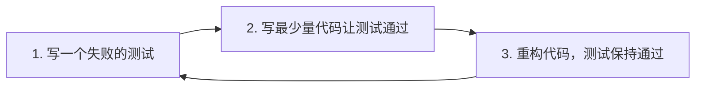

# 虾宝自我进化系统 - 单元测试整合规划

**版本：** v1.0  
**日期：** 2026-04-16  
**状态：** 测试规划阶段

---

## 目录

1. [测试现状分析](#1-测试现状分析)
2. [测试策略](#2-测试策略)
3. [测试金字塔](#3-测试金字塔)
4. [覆盖率目标](#4-覆盖率目标)
5. [现有测试整合](#5-现有测试整合)
6. [新增测试模块规划](#6-新增测试模块规划)
7. [测试工具链](#7-测试工具链)
8. [CI/CD 集成](#8-cicd-集成)
9. [测试执行计划](#9-测试执行计划)
10. [附录：测试模板](#10-附录测试模板)

---

## 1. 测试现状分析

### 1.1 现有测试文件清单

| 文件 | 覆盖模块 | 用例数 | 状态 |
|------|---------|--------|------|
| `test_shell_tools.py` | Shell 工具（12个） | ~80 | ✅ 完善 |
| `test_security.py` | 安全模块 | ~30 | ✅ 完善 |
| `test_memory_tools.py` | 记忆工具（15个） | ~50 | ✅ 完善 |
| `test_tool_executor.py` | 工具执行器 | ~20 | ✅ 完善 |
| `test_code_analysis_tools.py` | 代码分析（6个） | ~60 | ✅ 完善 |
| `test_rebirth_tools.py` | 重生工具 | ~50 | ✅ 完善 |
| `test_token_manager.py` | Token 管理器 | ~60 | ✅ 完善 |
| `test_search_tools.py` | 搜索工具（5个） | ~50 | ✅ 完善 |
| `conftest.py` | pytest 配置 | - | ✅ 完善 |

**总计：约 340+ 个测试用例**

### 1.2 现有测试特点

```python
# 现有测试架构特点
{
    "framework": "pytest",
    "fixtures": ["project_root", "workspace_dir", "mock_llm", "test_config"],
    "isolation": "tmp_path + monkeypatch",
    "assertion_style": "中文关键词",
    "test_categories": [
        "单元测试 (Unit)",
        "集成测试 (Integration)", 
        "性能测试 (Performance)",
        "安全测试 (Security)",
        "边界测试 (Edge Cases)",
        "异常处理 (Error Handling)"
    ],
    "coverage_areas": [
        "tools/shell_tools.py",
        "tools/memory_tools.py",
        "tools/code_analysis_tools.py",
        "tools/search_tools.py",
        "tools/rebirth_tools.py",
        "tools/token_manager.py",
        "core/security.py",
        "core/tool_executor.py"
    ]
}
```

### 1.3 覆盖率现状

```
测试覆盖率分析 (基于现有测试)
────────────────────────────────────────────────────────
模块                    文件数  覆盖率  优先级
────────────────────────────────────────────────────────
tools/shell_tools.py    12个   ~95%    已完成
tools/memory_tools.py   15个   ~90%    已完成
tools/code_analysis/     6个   ~85%    已完成
tools/search_tools/      5个   ~80%    已完成
tools/rebirth_tools/     6个   ~85%    已完成
tools/token_manager/      8个   ~80%    已完成
core/security.py          -    ~90%    已完成
core/tool_executor.py     -    ~75%    已完成
────────────────────────────────────────────────────────
总计                    ~52个  ~85%    良好
```

---

## 2. 测试策略

### 2.1 测试原则

```
┌─────────────────────────────────────────────────────────────┐
│                      测试五原则                                │
├─────────────────────────────────────────────────────────────┤
│  1. 快速 (Fast)          - 单元测试应在毫秒级完成              │
│  2. 独立 (Independent)   - 测试间无依赖，可并行执行          │
│  3. 可重复 (Repeatable)  - 任何环境结果一致                  │
│  4. 自验证 (Self-Checking) - 自动判断通过/失败              │
│  5. 及时 (Timely)        - 与代码同步编写测试                │
└─────────────────────────────────────────────────────────────┘
```

### 2.2 测试分层策略

| 层级 | 目标 | 执行频率 | 失败处理 |
|------|------|---------|---------|
| **单元测试** | 每个函数/方法正确性 | 每次提交 | 阻断 |
| **集成测试** | 模块间协作正确性 | 每次 PR | 阻断 |
| **E2E 测试** | 完整功能流程 | 每日/发布前 | 警告 |

### 2.3 测试驱动开发 (TDD) 流程



---

## 3. 测试金字塔

### 3.1 层级定义

```
                    ▲
                   /E\
                  /2E \        E2E Tests (5%)
                 /-----\       端到端测试
                / Inte \       集成测试 (15%)
               /gration\      
              /---------\      
             /  Unit    \     单元测试 (80%)
            /   Tests   \    
           /_____________\   
```

### 3.2 各层测试定义

#### 单元测试 (Unit Tests)

```python
# 单元测试示例：test_evolution_engine.py

class TestEvolutionEngine:
    """进化引擎单元测试"""
    
    def test_init_creates_required_components(self):
        """测试初始化创建必需组件"""
        engine = EvolutionEngine(config=test_config)
        
        assert engine.self_analyzer is not None
        assert engine.goal_generator is not None
        assert engine.task_planner is not None
        assert engine.code_modifier is not None
    
    def test_run_evolution_cycle_returns_result(self):
        """测试运行进化周期返回结果"""
        engine = EvolutionEngine(config=test_config)
        context = EvolutionContext(trigger_reason=EvolutionTrigger.MANUAL)
        
        result = asyncio.run(engine.run_evolution_cycle(context))
        
        assert isinstance(result, EvolutionResult)
        assert hasattr(result, 'success')
        assert hasattr(result, 'goals_completed')
    
    @pytest.mark.asyncio
    async def test_phase_self_analysis_produces_report(self):
        """测试自我分析阶段产生报告"""
        engine = EvolutionEngine(config=test_config)
        context = EvolutionContext()
        
        report = await engine._phase_self_analysis(context)
        
        assert isinstance(report, SelfAnalysisReport)
        assert len(report.capabilities) == 6  # 六大维度
```

#### 集成测试 (Integration Tests)

```python
# 集成测试示例：test_evolution_integration.py

class TestEvolutionIntegration:
    """进化流程集成测试"""
    
    @pytest.mark.asyncio
    async def test_full_evolution_workflow(self):
        """测试完整进化工作流"""
        # 1. 准备环境
        engine = create_test_engine()
        mock_llm = MockLLM()
        
        # 2. 执行进化
        result = await engine.run_evolution_cycle(
            EvolutionContext(trigger_reason=EvolutionTrigger.MANUAL)
        )
        
        # 3. 验证结果
        assert result.success
        assert len(result.completed_tasks) > 0
        
        # 4. 验证副作用
        memory = read_memory()
        assert 'last_evolution_time' in memory
    
    def test_evolution_with_real_codebase(self, tmp_path):
        """测试在真实代码库上的进化"""
        # 创建临时代码库
        create_fake_codebase(tmp_path)
        
        # 执行进化
        engine = EvolutionEngine(config=TestConfig(codebase_path=tmp_path))
        result = engine.run_sync()
        
        assert result.success
        assert len(result.code_changes) > 0
```

#### E2E 测试 (End-to-End Tests)

```python
# E2E 测试示例：test_agent_e2e.py

class TestAgentE2E:
    """Agent 端到端测试"""
    
    @pytest.mark.integration
    def test_agent_completes_task(self):
        """测试 Agent 完成真实任务"""
        # 启动 Agent
        agent = Agent(auto_mode=True)
        
        # 发送任务
        result = agent.execute_task("重构 core/agent.py")
        
        # 验证
        assert result.status == "completed"
        assert result.output_files_created > 0
        
        # 验证代码质量
        assert check_syntax("core/agent.py") == "OK"
        assert run_tests() == 0  # 所有测试通过
```

---

## 4. 覆盖率目标

### 4.1 覆盖率指标

```yaml
coverage_targets:
  overall:
    statement: 85%      # 语句覆盖率
    branch: 80%         # 分支覆盖率
    function: 90%       # 函数覆盖率
    line: 85%           # 行覆盖率
  
  by_module:
    core/evolution_engine.py:
      target: 90%
      critical_paths:
        - run_evolution_cycle
        - execute_task
        - validate_modification
    
    core/self_analyzer.py:
      target: 85%
      critical_paths:
        - assess_capabilities
        - analyze_codebase
        - identify_improvements
    
    core/goal_generator.py:
      target: 85%
      critical_paths:
        - generate_goals
        - validate_goal
    
    core/task_planner.py:
      target: 80%
      critical_paths:
        - create_plan
        - decompose_goal
        - adjust_plan
    
    tools/:
      target: 90%        # 工具层已有高覆盖率
    
    security/:
      target: 95%        # 安全层需要高覆盖率
```

### 4.2 覆盖率报告格式

```bash
# 生成覆盖率报告
pytest tests/ \
    --cov=core \
    --cov=tools \
    --cov-report=html \
    --cov-report=term-missing \
    --cov-fail-under=85

# 输出示例
========================== coverage summary ==========================
Name                              Stmts   Miss  Cover   Missing
--------------------------------------------------------------------
core/evolution_engine.py             450     45    90%     123,145,167
core/self_analyzer.py                280     42    85%     89,112,134
core/goal_generator.py               200     30    85%     45,67
core/task_planner.py                 320     64    80%     78,123,189
tools/shell_tools.py                 500     25    95%     234
tools/memory_tools.py                600     60    90%     123,234
--------------------------------------------------------------------
TOTAL                              2350    266    89%
=====================================================================
```

---

## 5. 现有测试整合

### 5.1 测试文件重组

```
tests/
├── conftest.py                    # 共享 fixtures [已有]
├── unit/                          # 单元测试
│   ├── __init__.py
│   ├── test_shell_tools.py        # [已有] Shell 工具
│   ├── test_memory_tools.py       # [已有] 记忆工具
│   ├── test_code_analysis.py      # [已有] 代码分析
│   ├── test_search_tools.py        # [已有] 搜索工具
│   ├── test_rebirth_tools.py       # [已有] 重生工具
│   ├── test_token_manager.py       # [已有] Token 管理
│   ├── test_security.py            # [已有] 安全模块
│   ├── test_tool_executor.py       # [已有] 工具执行器
│   ├── test_evolution_engine.py    # [新增] 进化引擎
│   ├── test_self_analyzer.py       # [新增] 自我分析器
│   ├── test_goal_generator.py     # [新增] 目标生成器
│   ├── test_task_planner.py        # [新增] 任务规划器
│   ├── test_code_modifier.py       # [新增] 代码修改器
│   ├── test_knowledge_graph.py     # [新增] 知识图谱
│   ├── test_skills_profiler.py     # [新增] 能力画像
│   └── test_memory_manager.py       # [新增] 记忆管理器
│
├── integration/                   # 集成测试
│   ├── __init__.py
│   ├── test_evolution_flow.py      # [新增] 进化流程
│   ├── test_agent_loop.py           # [新增] Agent 循环
│   ├── test_memory_persistence.py   # [新增] 记忆持久化
│   ├── test_tool_registry.py        # [新增] 工具注册
│   └── test_api_endpoints.py        # [新增] API 端点
│
├── e2e/                          # 端到端测试
│   ├── __init__.py
│   ├── test_autonomous_run.py        # [新增] 自主运行
│   ├── test_full_evolution.py        # [新增] 完整进化
│   └── test_self_improvement.py      # [新增] 自我改进
│
├── fixtures/                     # 测试数据
│   ├── __init__.py
│   ├── sample_code.py             # 示例代码
│   ├── sample_tasks.py            # 示例任务
│   └── mock_llm_responses.py      # Mock LLM 响应
│
├── utils/                         # 测试工具
│   ├── __init__.py
│   ├── coverage.py                # 覆盖率工具
│   ├── mocks.py                   # Mock 工具
│   └── helpers.py                 # 测试辅助
│
├── pytest.ini                     # pytest 配置
├── setup.cfg                      # 测试设置
└── run_tests.py                   # 测试运行脚本
```

### 5.2 conftest.py 扩展

```python
#!/usr/bin/env python3
"""
pytest 配置和共享 fixtures - 扩展版

在原有基础上增加：
- 进化引擎 fixtures
- Mock LLM 响应
- 临时代码库
- 性能测试支持
"""

import pytest
import os
import sys
import tempfile
import shutil
import asyncio
from pathlib import Path
from unittest.mock import MagicMock, AsyncMock
from typing import Dict, Any, List

PROJECT_ROOT = Path(__file__).parent.parent
sys.path.insert(0, str(PROJECT_ROOT))


# ============================================================================
# 核心 Fixtures
# ============================================================================

@pytest.fixture
def project_root():
    """返回项目根目录"""
    return PROJECT_ROOT


@pytest.fixture(scope="session")
def workspace_dir():
    """创建临时工作空间目录"""
    temp_dir = tempfile.mkdtemp(prefix="agent_test_")
    yield temp_dir
    shutil.rmtree(temp_dir, ignore_errors=True)


@pytest.fixture
def mock_llm():
    """创建 Mock LLM"""
    mock = MagicMock()
    mock.invoke.return_value = MagicMock(
        content="这是一个测试响应。测试完成。"
    )
    return mock


@pytest.fixture
def mock_llm_async():
    """创建异步 Mock LLM"""
    mock = AsyncMock()
    mock.ainvoke.return_value = MagicMock(
        content="异步测试响应"
    )
    return mock


@pytest.fixture
def test_config():
    """创建测试配置"""
    class MockLLMConfig:
        model_name = "gpt-4o-mini"
        api_key = "test-key"
        api_base = None
        temperature = 0.7

    class MockCompressionConfig:
        max_token_limit = 4000
        keep_recent_steps = 3
        summary_max_chars = 300
        compression_model = "gpt-4o-mini"

    class MockAgentConfig:
        name = "TestAgent"
        awake_interval = 60
        auto_backup = False
        backup_interval = 3600
        max_iterations = 10

    class MockEvolutionConfig:
        enabled = True
        evolution_interval = 1
        evolution_timeout = 1800
        require_test_pass = True
        safety_level = "MEDIUM"

    class MockConfig:
        llm = MockLLMConfig()
        context_compression = MockCompressionConfig()
        agent = MockAgentConfig()
        evolution = MockEvolutionConfig()

        def get_api_key(self):
            return "test-key"

    return MockConfig()


# ============================================================================
# 进化引擎 Fixtures
# ============================================================================

@pytest.fixture
def mock_self_analyzer():
    """Mock 自我分析器"""
    analyzer = MagicMock()
    analyzer.assess_capabilities = AsyncMock(return_value=[
        CapabilityScore(dimension="code_quality", score=0.7),
        CapabilityScore(dimension="tool_power", score=0.8),
        # ...
    ])
    analyzer.analyze_codebase = AsyncMock(return_value=[])
    return analyzer


@pytest.fixture
def mock_goal_generator():
    """Mock 目标生成器"""
    generator = MagicMock()
    generator.generate_goals = AsyncMock(return_value=[
        EvolutionGoal(
            id="test_goal_1",
            title="测试目标",
            priority=1
        )
    ])
    return generator


@pytest.fixture
def mock_task_planner():
    """Mock 任务规划器"""
    planner = MagicMock()
    planner.create_plan = MagicMock(return_value=TaskPlan(
        id="plan_1",
        tasks=[PlannedTask(id="task_1", name="测试任务")]
    ))
    return planner


@pytest.fixture
def mock_code_modifier():
    """Mock 代码修改器"""
    modifier = MagicMock()
    modifier.execute_modification = AsyncMock(return_value=ModificationResult(
        success=True,
        change_id="change_1"
    ))
    return modifier


@pytest.fixture
def mock_safety_gate():
    """Mock 安全门控"""
    gate = MagicMock()
    gate.validate_modification = AsyncMock(return_value=ValidationResult(
        passed=True
    ))
    return gate


@pytest.fixture
def mock_memory_manager():
    """Mock 记忆管理器"""
    manager = MagicMock()
    manager.save = MagicMock(return_value=True)
    manager.load = MagicMock(return_value={})
    return manager


@pytest.fixture
def mock_knowledge_graph():
    """Mock 知识图谱"""
    kg = MagicMock()
    kg.add_entity = MagicMock(return_value="entity_1")
    kg.query = MagicMock(return_value=QueryResult(nodes=[], edges=[]))
    return kg


@pytest.fixture
def mock_skills_profiler():
    """Mock 能力画像"""
    profiler = MagicMock()
    profiler.evaluate_all = AsyncMock(return_value=CapabilityProfile(
        agent_id="test",
        generation=1,
        overall_score=0.7
    ))
    return profiler


@pytest.fixture
def evolution_engine_with_mocks(
    test_config,
    mock_self_analyzer,
    mock_goal_generator,
    mock_task_planner,
    mock_code_modifier,
    mock_safety_gate,
    mock_memory_manager,
    mock_knowledge_graph,
    mock_skills_profiler,
):
    """创建带 Mock 的进化引擎"""
    from core.evolution_engine import EvolutionEngine
    
    return EvolutionEngine(
        config=test_config,
        self_analyzer=mock_self_analyzer,
        goal_generator=mock_goal_generator,
        task_planner=mock_task_planner,
        code_modifier=mock_code_modifier,
        safety_gate=mock_safety_gate,
        memory_manager=mock_memory_manager,
        knowledge_graph=mock_knowledge_graph,
        skills_profiler=mock_skills_profiler,
    )


# ============================================================================
# 临时代码库 Fixtures
# ============================================================================

@pytest.fixture
def temp_codebase(tmp_path):
    """创建临时代码库用于测试"""
    # 创建目录结构
    src_dir = tmp_path / "src"
    src_dir.mkdir()
    
    # 创建示例 Python 文件
    sample_file = src_dir / "sample.py"
    sample_file.write_text('''
class SampleClass:
    """示例类"""
    
    def __init__(self, value):
        self.value = value
    
    def get_value(self):
        return self.value
    
    def set_value(self, new_value):
        self.value = new_value

def helper_function(x, y):
    """辅助函数"""
    return x + y
''')
    
    return {
        "root": tmp_path,
        "src_dir": src_dir,
        "sample_file": sample_file
    }


# ============================================================================
# Mock LLM 响应库
# ============================================================================

@pytest.fixture
def mock_llm_responses():
    """Mock LLM 响应集合"""
    return {
        "evolution_plan": """
        我制定了以下进化计划：
        1. 分析代码结构
        2. 识别改进点
        3. 制定重构计划
        4. 执行代码修改
        5. 验证修改结果
        """,
        "code_analysis": """
        代码分析结果：
        - 文件数：5
        - 函数数：12
        - 类数：3
        - 复杂度：中等
        """,
        "task_completion": """
        任务已完成！
        - 修改文件数：2
        - 新增代码行：45
        - 删除代码行：12
        - 测试通过：是
        """
    }


# ============================================================================
# 性能测试 Fixtures
# ============================================================================

@pytest.fixture
def performance_benchmark():
    """性能基准测试"""
    import time
    
    class Benchmark:
        def __init__(self):
            self.results = {}
        
        def measure(self, name: str, func, *args, **kwargs):
            start = time.time()
            result = func(*args, **kwargs)
            elapsed = time.time() - start
            self.results[name] = elapsed
            return result, elapsed
        
        def report(self) -> Dict[str, float]:
            return self.results
    
    return Benchmark()


# ============================================================================
# 事件总线 Fixtures
# ============================================================================

@pytest.fixture
def event_bus():
    """创建测试用事件总线"""
    from core.event_bus import EventBus
    return EventBus()


@pytest.fixture
def event_listener():
    """创建事件监听器"""
    received_events = []
    
    def listener(event):
        received_events.append(event)
    
    listener.received = received_events
    return listener


# ============================================================================
# 清理 Fixtures
# ============================================================================

@pytest.fixture(autouse=True)
def reset_workspace_state():
    """每个测试前后重置工作空间状态"""
    yield
    # 测试后清理
    import glob
    test_files = glob.glob(str(PROJECT_ROOT / "workspace" / "test_*.json"))
    for f in test_files:
        try:
            os.remove(f)
        except Exception:
            pass


# ============================================================================
# 异步支持
# ============================================================================

@pytest.fixture(scope="session")
def event_loop():
    """创建事件循环用于异步测试"""
    loop = asyncio.get_event_loop_policy().new_event_loop()
    yield loop
    loop.close()
```

### 5.3 pytest.ini 配置

```ini
[pytest]
# 测试发现
python_files = test_*.py
python_classes = Test*
python_functions = test_*

# 测试路径
testpaths = tests
addopts = 
    -v
    --tb=short
    --strict-markers
    --disable-warnings
    -p no:warnings

# 标记定义
markers =
    # 单元测试
    unit: 单元测试
    integration: 集成测试
    e2e: 端到端测试
    
    # 性能测试
    slow: 慢速测试
    performance: 性能测试
    benchmark: 基准测试
    
    # 安全测试
    security: 安全测试
    
    # 异步测试
    asyncio: 异步测试
    
    # 特定功能
    evolution: 进化相关测试
    memory: 记忆相关测试
    tools: 工具相关测试

# 覆盖率配置
[coverage:run]
source = 
    core
    tools
omit = 
    tests/*
    */migrations/*
    */__pycache__/*
    */venv/*

[coverage:report]
precision = 2
show_missing = True
skip_covered = False

# 异步配置
asyncio_mode = auto
```

---

## 6. 新增测试模块规划

### 6.1 进化引擎测试

```python
# tests/unit/test_evolution_engine.py

import pytest
import asyncio
from core.evolution_engine import (
    EvolutionEngine,
    EvolutionContext,
    EvolutionPhase,
    EvolutionTrigger,
    EvolutionResult,
)


class TestEvolutionEngine:
    """进化引擎单元测试"""
    
    # ==================== 初始化测试 ====================
    
    def test_init_creates_all_components(self, test_config):
        """测试初始化创建所有组件"""
        engine = EvolutionEngine(config=test_config)
        
        assert engine.self_analyzer is not None
        assert engine.goal_generator is not None
        assert engine.task_planner is not None
        assert engine.code_modifier is not None
        assert engine.safety_gate is not None
        assert engine.memory_manager is not None
        assert engine.knowledge_graph is not None
        assert engine.skills_profiler is not None
    
    def test_init_with_custom_components(self, test_config):
        """测试使用自定义组件初始化"""
        custom_analyzer = MagicMock()
        
        engine = EvolutionEngine(
            config=test_config,
            self_analyzer=custom_analyzer
        )
        
        assert engine.self_analyzer is custom_analyzer
    
    # ==================== 状态测试 ====================
    
    def test_get_evolution_status_idle(self, evolution_engine_with_mocks):
        """测试空闲状态"""
        engine = evolution_engine_with_mocks
        
        status = engine.get_evolution_status()
        
        assert status.phase == EvolutionPhase.IDLE
        assert status.is_running is False
    
    def test_get_current_phase(self, evolution_engine_with_mocks):
        """测试获取当前阶段"""
        engine = evolution_engine_with_mocks
        
        phase = engine.get_current_phase()
        
        assert isinstance(phase, EvolutionPhase)
    
    def test_get_progress_empty(self, evolution_engine_with_mocks):
        """测试空进度"""
        engine = evolution_engine_with_mocks
        
        progress = engine.get_progress()
        
        assert progress.completed_tasks == 0
        assert progress.total_tasks == 0
        assert progress.percentage == 0.0
    
    # ==================== 进化周期测试 ====================
    
    @pytest.mark.asyncio
    async def test_run_evolution_cycle_success(
        self,
        evolution_engine_with_mocks,
        mock_llm_responses
    ):
        """测试成功执行完整进化周期"""
        engine = evolution_engine_with_mocks
        context = EvolutionContext(
            trigger_reason=EvolutionTrigger.MANUAL
        )
        
        result = await engine.run_evolution_cycle(context)
        
        assert isinstance(result, EvolutionResult)
        assert result.success is True
    
    @pytest.mark.asyncio
    async def test_run_evolution_timeout(self, evolution_engine_with_mocks):
        """测试进化超时"""
        engine = evolution_engine_with_mocks
        context = EvolutionContext(
            trigger_reason=EvolutionTrigger.MANUAL,
            timeout_seconds=0.001  # 极短超时
        )
        
        with pytest.raises(EvolutionTimeoutError):
            await engine.run_evolution_cycle(context)
    
    @pytest.mark.asyncio
    async def test_run_evolution_with_focus_areas(
        self,
        evolution_engine_with_mocks
    ):
        """测试指定关注领域的进化"""
        engine = evolution_engine_with_mocks
        context = EvolutionContext(
            trigger_reason=EvolutionTrigger.MANUAL,
            focus_areas=[CapabilityDimension.CODE_QUALITY]
        )
        
        result = await engine.run_evolution_cycle(context)
        
        # 验证只关注指定领域
        assert result.focused_on == [CapabilityDimension.CODE_QUALITY]
    
    # ==================== 阶段测试 ====================
    
    @pytest.mark.asyncio
    async def test_phase_self_analysis(self, evolution_engine_with_mocks):
        """测试自我分析阶段"""
        engine = evolution_engine_with_mocks
        context = EvolutionContext()
        
        report = await engine._phase_self_analysis(context)
        
        assert isinstance(report, SelfAnalysisReport)
        assert len(report.capabilities) == 6  # 六大维度
        assert report.overall_score >= 0.0
        assert report.overall_score <= 1.0
    
    @pytest.mark.asyncio
    async def test_phase_goal_generation(self, evolution_engine_with_mocks):
        """测试目标生成阶段"""
        engine = evolution_engine_with_mocks
        context = EvolutionContext()
        analysis = SelfAnalysisReport(...)
        
        goals = await engine._phase_goal_generation(context, analysis)
        
        assert isinstance(goals, list)
        assert len(goals) > 0
        assert all(isinstance(g, EvolutionGoal) for g in goals)
    
    @pytest.mark.asyncio
    async def test_phase_planning(self, evolution_engine_with_mocks):
        """测试规划阶段"""
        engine = evolution_engine_with_mocks
        context = EvolutionContext()
        goals = [EvolutionGoal(id="g1", title="Test")]
        
        plans = await engine._phase_planning(context, goals)
        
        assert isinstance(plans, list)
    
    @pytest.mark.asyncio
    async def test_phase_execution(self, evolution_engine_with_mocks):
        """测试执行阶段"""
        engine = evolution_engine_with_mocks
        context = EvolutionContext()
        plan = TaskPlan(id="p1", tasks=[])
        
        result = await engine._phase_execution(context, plan)
        
        assert isinstance(result, ExecutionResult)
    
    @pytest.mark.asyncio
    async def test_phase_validation(self, evolution_engine_with_mocks):
        """测试验证阶段"""
        engine = evolution_engine_with_mocks
        context = EvolutionContext()
        execution = ExecutionResult(...)
        
        result = await engine._phase_validation(context, execution)
        
        assert isinstance(result, ValidationResult)
    
    @pytest.mark.asyncio
    async def test_phase_archivization(self, evolution_engine_with_mocks):
        """测试归档阶段"""
        engine = evolution_engine_with_mocks
        context = EvolutionContext()
        evolution_result = EvolutionResult(...)
        
        result = await engine._phase_archivization(context, evolution_result)
        
        assert isinstance(result, ArchiveResult)
    
    # ==================== 目标管理测试 ====================
    
    def test_add_goal(self, evolution_engine_with_mocks):
        """测试添加目标"""
        engine = evolution_engine_with_mocks
        goal = EvolutionGoal(
            id="new_goal",
            title="新目标",
            priority=1
        )
        
        goal_id = engine.add_goal(goal)
        
        assert goal_id == "new_goal"
    
    def test_prioritize_goals(self, evolution_engine_with_mocks):
        """测试目标排序"""
        engine = evolution_engine_with_mocks
        goals = [
            EvolutionGoal(id="g3", priority=3),
            EvolutionGoal(id="g1", priority=1),
            EvolutionGoal(id="g2", priority=2),
        ]
        
        sorted_goals = engine.prioritize_goals(goals)
        
        assert sorted_goals[0].id == "g1"
        assert sorted_goals[1].id == "g2"
        assert sorted_goals[2].id == "g3"
    
    def test_validate_goal(self, evolution_engine_with_mocks):
        """测试目标验证"""
        engine = evolution_engine_with_mocks
        goal = EvolutionGoal(
            id="test",
            title="测试",
            priority=1
        )
        
        validation = engine.validate_goal(goal)
        
        assert isinstance(validation, GoalValidationResult)
    
    # ==================== 控制测试 ====================
    
    def test_pause_evolution(self, evolution_engine_with_mocks):
        """测试暂停进化"""
        engine = evolution_engine_with_mocks
        
        engine.pause_evolution()
        
        assert engine.is_paused is True
        assert engine.get_evolution_status().is_paused is True
    
    def test_resume_evolution(self, evolution_engine_with_mocks):
        """测试恢复进化"""
        engine = evolution_engine_with_mocks
        engine.pause_evolution()
        
        engine.resume_evolution()
        
        assert engine.is_paused is False
    
    def test_abort_evolution(self, evolution_engine_with_mocks):
        """测试中止进化"""
        engine = evolution_engine_with_mocks
        
        engine.abort_evolution(reason="用户取消")
        
        assert engine.is_aborted is True
        assert engine.get_evolution_status().status == "ABORTED"
    
    # ==================== 事件测试 ====================
    
    def test_subscribe_to_phase(self, evolution_engine_with_mocks):
        """测试订阅阶段事件"""
        engine = evolution_engine_with_mocks
        received = []
        
        def handler(event):
            received.append(event)
        
        subscription = engine.subscribe_to_phase(
            EvolutionPhase.SELF_ANALYSIS,
            handler
        )
        
        assert subscription is not None
        assert len(engine._phase_subscribers[EvolutionPhase.SELF_ANALYSIS]) > 0
    
    def test_subscribe_to_task(self, evolution_engine_with_mocks):
        """测试订阅任务事件"""
        engine = evolution_engine_with_mocks
        received = []
        
        def handler(event):
            received.append(event)
        
        subscription = engine.subscribe_to_task("task_1", handler)
        
        assert subscription is not None
    
    # ==================== 历史测试 ====================
    
    def test_get_evolution_history(self, evolution_engine_with_mocks):
        """测试获取进化历史"""
        engine = evolution_engine_with_mocks
        
        history = engine.get_evolution_history(limit=10)
        
        assert isinstance(history, list)
    
    def test_replay_evolution(self, evolution_engine_with_mocks):
        """测试回放历史进化"""
        engine = evolution_engine_with_mocks
        
        replay = engine.replay_evolution("evo_123")
        
        assert isinstance(replay, EvolutionReplay)
```

### 6.2 自我分析器测试

```python
# tests/unit/test_self_analyzer.py

import pytest
from core.self_analyzer import (
    SelfAnalyzer,
    SelfAnalysisReport,
    CapabilityScore,
    CapabilityDimension,
)


class TestSelfAnalyzer:
    """自我分析器单元测试"""
    
    @pytest.fixture
    def analyzer(self, test_config):
        return SelfAnalyzer(config=test_config)
    
    # ==================== 能力评估测试 ====================
    
    @pytest.mark.asyncio
    async def test_assess_capabilities_returns_six_dimensions(self, analyzer):
        """测试评估返回六大维度"""
        scores = await analyzer.assess_capabilities()
        
        assert len(scores) == 6
        assert all(isinstance(s, CapabilityScore) for s in scores)
    
    @pytest.mark.asyncio
    async def test_assess_code_quality(self, analyzer):
        """测试代码质量评估"""
        score = analyzer._assess_code_quality(evidence=[])
        
        assert isinstance(score, CapabilityScore)
        assert score.dimension == CapabilityDimension.CODE_QUALITY
        assert 0.0 <= score.score <= 1.0
    
    @pytest.mark.asyncio
    async def test_assess_tool_power(self, analyzer):
        """测试工具能力评估"""
        score = analyzer._assess_tool_power(evidence=[])
        
        assert score.dimension == CapabilityDimension.TOOL_POWER
    
    @pytest.mark.asyncio
    async def test_assess_learning(self, analyzer):
        """测试学习能力评估"""
        score = analyzer._assess_learning(evidence=[])
        
        assert score.dimension == CapabilityDimension.LEARNING
    
    @pytest.mark.asyncio
    async def test_assess_planning(self, analyzer):
        """测试规划能力评估"""
        score = analyzer._assess_planning(evidence=[])
        
        assert score.dimension == CapabilityDimension.PLANNING
    
    @pytest.mark.asyncio
    async def test_assess_autonomy(self, analyzer):
        """测试自主性评估"""
        score = analyzer._assess_autonomy(evidence=[])
        
        assert score.dimension == CapabilityDimension.AUTONOMY
    
    @pytest.mark.asyncio
    async def test_assess_memory(self, analyzer):
        """测试记忆能力评估"""
        score = analyzer._assess_memory(evidence=[])
        
        assert score.dimension == CapabilityDimension.MEMORY
    
    # ==================== 代码分析测试 ====================
    
    @pytest.mark.asyncio
    async def test_analyze_codebase(self, analyzer, temp_codebase):
        """测试分析代码库"""
        analyses = await analyzer.analyze_codebase(
            scope=[str(temp_codebase["src_dir"])]
        )
        
        assert isinstance(analyses, list)
    
    def test_analyze_file(self, analyzer, temp_codebase):
        """测试分析单个文件"""
        analysis = analyzer.analyze_file(
            str(temp_codebase["sample_file"])
        )
        
        assert isinstance(analysis, CodeAnalysis)
        assert analysis.file == str(temp_codebase["sample_file"])
    
    def test_calculate_complexity(self, analyzer, temp_codebase):
        """测试计算复杂度"""
        metrics = analyzer.calculate_complexity(
            str(temp_codebase["sample_file"])
        )
        
        assert isinstance(metrics, CodeMetrics)
        assert metrics.cyclomatic_complexity > 0
    
    def test_find_code_smells(self, analyzer, temp_codebase):
        """测试查找代码异味"""
        issues = analyzer.find_code_smells(
            str(temp_codebase["sample_file"])
        )
        
        assert isinstance(issues, list)
    
    # ==================== 工具分析测试 ====================
    
    @pytest.mark.asyncio
    async def test_analyze_tool_usage(self, analyzer):
        """测试分析工具使用"""
        stats = await analyzer.analyze_tool_usage()
        
        assert isinstance(stats, ToolUsageStats)
        assert hasattr(stats, 'total_calls')
        assert hasattr(stats, 'success_rate')
    
    def test_get_tool_success_rate(self, analyzer):
        """测试获取工具成功率"""
        rate = analyzer.get_tool_success_rate("read_file")
        
        assert 0.0 <= rate <= 1.0
    
    # ==================== 任务分析测试 ====================
    
    @pytest.mark.asyncio
    async def test_analyze_task_completion(self, analyzer):
        """测试分析任务完成"""
        stats = await analyzer.analyze_task_completion()
        
        assert isinstance(stats, TaskCompletionStats)
    
    # ==================== 综合分析测试 ====================
    
    @pytest.mark.asyncio
    async def test_generate_analysis_report(self, analyzer):
        """测试生成分析报告"""
        report = await analyzer.generate_analysis_report(generation=1)
        
        assert isinstance(report, SelfAnalysisReport)
        assert len(report.capabilities) == 6
        assert 0.0 <= report.overall_score <= 1.0
    
    def test_compare_with_previous(self, analyzer):
        """测试与上一次分析对比"""
        current = SelfAnalysisReport(generation=2, ...)
        previous = SelfAnalysisReport(generation=1, ...)
        
        comparison = analyzer.compare_with_previous(current, previous)
        
        assert isinstance(comparison, ComparisonResult)
    
    # ==================== 改进机会测试 ====================
    
    def test_identify_improvement_opportunities(self, analyzer):
        """测试识别改进机会"""
        report = SelfAnalysisReport(...)
        
        opportunities = analyzer.identify_improvement_opportunities(report)
        
        assert isinstance(opportunities, list)
```

### 6.3 目标生成器测试

```python
# tests/unit/test_goal_generator.py

import pytest
from core.goal_generator import (
    GoalGenerator,
    GoalCategory,
    EvolutionGoal,
)


class TestGoalGenerator:
    """目标生成器单元测试"""
    
    @pytest.fixture
    def generator(self, test_config):
        return GoalGenerator(config=test_config)
    
    # ==================== 目标生成测试 ====================
    
    @pytest.mark.asyncio
    async def test_generate_goals_returns_list(self, generator):
        """测试生成目标返回列表"""
        analysis = SelfAnalysisReport(...)
        mission = Mission(...)
        
        goals = await generator.generate_goals(
            analysis=analysis,
            mission=mission,
            constraints=[]
        )
        
        assert isinstance(goals, list)
    
    @pytest.mark.asyncio
    async def test_generate_code_quality_goals(self, generator):
        """测试生成代码质量目标"""
        analysis = SelfAnalysisReport(...)
        
        goals = generator.generate_code_quality_goals(analysis)
        
        assert all(g.category == GoalCategory.CODE_QUALITY for g in goals)
    
    @pytest.mark.asyncio
    async def test_generate_architecture_goals(self, generator):
        """测试生成架构目标"""
        goals = generator.generate_architecture_goals(analysis)
        
        assert all(g.category == GoalCategory.ARCHITECTURE for g in goals)
    
    # ==================== 目标验证测试 ====================
    
    def test_validate_goal_valid(self, generator):
        """测试验证有效目标"""
        goal = EvolutionGoal(
            id="test",
            title="测试目标",
            description="详细描述",
            priority=1
        )
        
        validation = generator.validate_goal(goal, constraints=[])
        
        assert validation.is_valid is True
        assert len(validation.errors) == 0
    
    def test_validate_goal_invalid(self, generator):
        """测试验证无效目标"""
        goal = EvolutionGoal(
            id="test",
            title="",  # 空标题
            description=""  # 空描述
        )
        
        validation = generator.validate_goal(goal, constraints=[])
        
        assert validation.is_valid is False
        assert len(validation.errors) > 0
    
    def test_validate_goal_smarter_principles(self, generator):
        """测试 SMART 原则验证"""
        # Specific - 具体
        goal_specific = EvolutionGoal(
            title="提高代码质量",
            description="通过重构提升代码质量"
        )
        
        # Measurable - 可衡量
        goal_measurable = EvolutionGoal(
            title="提高代码质量",
            description="将代码质量评分从 0.6 提升到 0.8"
        )
        
        # Achievable - 可实现
        # Relevant - 相关
        # Time-bound - 有时限
        
        v1 = generator.validate_goal(goal_specific, [])
        v2 = generator.validate_goal(goal_measurable, [])
        
        assert v1.is_valid is True
        assert v2.is_valid is True
    
    # ==================== 难度评估测试 ====================
    
    def test_estimate_goal_difficulty(self, generator):
        """测试评估目标难度"""
        goal = EvolutionGoal(
            title="测试",
            description="测试目标"
        )
        
        estimate = generator.estimate_goal_difficulty(goal)
        
        assert isinstance(estimate, DifficultyEstimate)
        assert 0.0 <= estimate.score <= 1.0
```

### 6.4 任务规划器测试

```python
# tests/unit/test_task_planner.py

import pytest
from core.task_planner import (
    TaskPlanner,
    TaskType,
    TaskStatus,
    TaskPlan,
)


class TestTaskPlanner:
    """任务规划器单元测试"""
    
    @pytest.fixture
    def planner(self, test_config):
        return TaskPlanner(config=test_config)
    
    # ==================== 计划创建测试 ====================
    
    def test_create_plan(self, planner):
        """测试创建计划"""
        goal = EvolutionGoal(id="g1", title="测试")
        context = PlanningContext(...)
        
        plan = planner.create_plan(goal, context)
        
        assert isinstance(plan, TaskPlan)
        assert plan.goal_id == "g1"
    
    def test_decompose_goal(self, planner):
        """测试分解目标"""
        goal = EvolutionGoal(
            id="g1",
            title="重构代码",
            description="重构核心模块"
        )
        
        tasks = planner.decompose_goal(goal)
        
        assert isinstance(tasks, list)
        assert len(tasks) > 0
        assert all(isinstance(t, PlannedTask) for t in tasks)
    
    # ==================== 依赖分析测试 ====================
    
    def test_analyze_dependencies(self, planner):
        """测试分析依赖"""
        tasks = [
            PlannedTask(id="t1"),
            PlannedTask(id="t2", dependencies=["t1"]),
            PlannedTask(id="t3", dependencies=["t2"]),
        ]
        
        dep_graph = planner.analyze_dependencies(tasks)
        
        assert isinstance(dep_graph, DependencyGraph)
    
    def test_identify_parallel_tasks(self, planner):
        """测试识别并行任务"""
        tasks = [
            PlannedTask(id="t1"),
            PlannedTask(id="t2"),  # t1 和 t2 可并行
            PlannedTask(id="t3", dependencies=["t1", "t2"]),  # 依赖前两者
        ]
        
        parallel_groups = planner.identify_parallel_tasks(tasks)
        
        assert isinstance(parallel_groups, list)
        assert len(parallel_groups) >= 1
    
    # ==================== 时间估算测试 ====================
    
    def test_estimate_task_time(self, planner):
        """测试估算任务时间"""
        task = PlannedTask(
            id="t1",
            name="测试任务",
            task_type=TaskType.ANALYZE
        )
        
        estimate = planner.estimate_task_time(task)
        
        assert isinstance(estimate, TimeEstimate)
        assert estimate.estimated_minutes > 0
    
    # ==================== 风险评估测试 ====================
    
    def test_assess_task_risk(self, planner):
        """测试评估任务风险"""
        task = PlannedTask(
            id="t1",
            name="高风险任务",
            task_type=TaskType.MODIFY
        )
        
        assessment = planner.assess_task_risk(task)
        
        assert isinstance(assessment, RiskAssessment)
        assert 0.0 <= assessment.score <= 1.0
    
    # ==================== 优先级测试 ====================
    
    def test_prioritize_tasks_risk_first(self, planner):
        """测试按风险优先级"""
        tasks = [
            PlannedTask(id="t1", risk_level=RiskLevel.LOW),
            PlannedTask(id="t2", risk_level=RiskLevel.HIGH),
            PlannedTask(id="t3", risk_level=RiskLevel.MEDIUM),
        ]
        
        sorted_tasks = planner.prioritize_tasks(
            tasks,
            PrioritizationStrategy.RISK_FIRST
        )
        
        assert sorted_tasks[0].risk_level == RiskLevel.HIGH
    
    # ==================== 计划调整测试 ====================
    
    def test_adjust_plan_on_success(self, planner):
        """测试成功时调整计划"""
        plan = TaskPlan(id="p1", tasks=[])
        feedback = ExecutionFeedback(
            task_id="t1",
            status="COMPLETED"
        )
        
        adjusted = planner.adjust_plan(plan, feedback)
        
        assert isinstance(adjusted, TaskPlan)
    
    def test_adjust_plan_on_failure(self, planner):
        """测试失败时调整计划"""
        plan = TaskPlan(id="p1", tasks=[])
        feedback = ExecutionFeedback(
            task_id="t1",
            status="FAILED",
            error="语法错误"
        )
        
        adjusted = planner.adjust_plan(plan, feedback)
        
        assert adjusted is not None
    
    # ==================== 验证测试 ====================
    
    def test_validate_plan_complete(self, planner):
        """测试验证完整计划"""
        plan = TaskPlan(
            id="p1",
            tasks=[
                PlannedTask(id="t1", verification_method=VerificationMethod.TEST),
            ]
        )
        
        validation = planner.validate_plan(plan)
        
        assert validation.is_valid is True
    
    def test_validate_plan_circular_dependency(self, planner):
        """测试循环依赖检测"""
        tasks = [
            PlannedTask(id="t1", dependencies=["t2"]),
            PlannedTask(id="t2", dependencies=["t1"]),
        ]
        plan = TaskPlan(id="p1", tasks=tasks)
        
        validation = planner.validate_plan(plan)
        
        assert validation.is_valid is False
        assert "循环依赖" in str(validation.errors)
```

---

## 7. 测试工具链

### 7.1 依赖包

```txt
# tests/requirements.txt

# 核心测试框架
pytest>=7.4.0
pytest-asyncio>=0.21.0
pytest-cov>=4.1.0
pytest-mock>=3.11.0
pytest-timeout>=2.1.0
pytest-xdist>=3.3.0  # 并行执行
pytest-repeat>=0.9.1  # 重复执行
pytest-benchmark>=4.0.0  # 性能基准

# Mock 库
pytest-httpx>=0.25.0
responses>=0.23.0

# 覆盖率
coverage>=7.3.0
codecov>=2.1.0

# 类型检查
mypy>=1.5.0
pyright>=1.1.0

# 代码质量
ruff>=0.1.0
pylint>=3.0.0

# 内存泄漏检测
tracemalloc>=1.0.0
psutil>=5.9.0

# 集成测试
playwright>=1.38.0  # E2E 测试
selenium>=4.15.0
```

### 7.2 测试运行脚本

```python
#!/usr/bin/env python3
"""
测试运行脚本 - tests/run_tests.py

支持：
- 按类别运行测试
- 并行执行
- 覆盖率报告
- 性能基准
"""

import sys
import subprocess
import argparse
from pathlib import Path


def run_tests(
    category: str = "all",
    parallel: bool = True,
    coverage: bool = True,
    markers: list = None
):
    """运行测试"""
    cmd = ["pytest", "tests/"]
    
    # 按类别选择测试
    if category == "unit":
        cmd.append("tests/unit/")
    elif category == "integration":
        cmd.append("tests/integration/")
    elif category == "e2e":
        cmd.append("tests/e2e/")
    elif category == "fast":
        cmd.extend(["-m", "not slow"])
    
    # 并行执行
    if parallel:
        cmd.extend(["-n", "auto"])  # 自动使用所有 CPU
    
    # 覆盖率
    if coverage:
        cmd.extend([
            "--cov=core",
            "--cov=tools",
            "--cov-report=html",
            "--cov-report=term-missing",
            "--cov-fail-under=85"
        ])
    
    # 自定义标记
    if markers:
        cmd.extend(["-m", " or ".join(markers)])
    
    # 详细输出
    cmd.extend(["-v", "--tb=short"])
    
    # 运行
    result = subprocess.run(cmd)
    return result.returncode


def run_coverage():
    """生成覆盖率报告"""
    cmd = [
        "pytest",
        "tests/",
        "--cov=.",
        "--cov-report=html:htmlcov",
        "--cov-report=term",
        "--cov-report=lcov",
        "--cov-branch",
        "--cov-fail-under=85"
    ]
    subprocess.run(cmd)


def run_performance():
    """运行性能测试"""
    cmd = [
        "pytest",
        "tests/",
        "-m", "performance",
        "--benchmark-only",
        "--benchmark-json=benchmark.json"
    ]
    subprocess.run(cmd)


if __name__ == "__main__":
    parser = argparse.ArgumentParser()
    parser.add_argument("--category", default="all", choices=["all", "unit", "integration", "e2e", "fast"])
    parser.add_argument("--parallel", action="store_true", default=True)
    parser.add_argument("--no-coverage", action="store_true")
    parser.add_argument("--benchmark", action="store_true")
    args = parser.parse_args()
    
    if args.benchmark:
        run_performance()
    else:
        exit(run_tests(
            category=args.category,
            parallel=args.parallel,
            coverage=not args.no_coverage
        ))
```

### 7.3 Makefile

```makefile
# tests/Makefile

.PHONY: test test-unit test-integration test-e2e test-coverage test-benchmark test-fix

# 运行所有测试
test:
	pytest tests/ -v --cov=. --cov-fail-under=85

# 单元测试
test-unit:
	pytest tests/unit/ -v

# 集成测试
test-integration:
	pytest tests/integration/ -v

# E2E 测试
test-e2e:
	pytest tests/e2e/ -v

# 快速测试（跳过慢速测试）
test-fast:
	pytest tests/ -v -m "not slow"

# 并行测试
test-parallel:
	pytest tests/ -n auto -v

# 覆盖率报告
test-coverage:
	pytest tests/ --cov=. --cov-report=html --cov-report=term
	open htmlcov/index.html  # macOS

# 性能基准
test-benchmark:
	pytest tests/ -m benchmark --benchmark-only

# 只运行失败的测试
test-fix:
	pytest tests/ --lf

# 生成覆盖率徽章数据
coverage-badge:
	coverage json -o coverage.json
	coverage html

# 代码检查
lint:
	ruff check tests/
	mypy tests/

# 格式化
format:
	ruff format tests/
```

---

## 8. CI/CD 集成

### 8.1 GitHub Actions 工作流

```yaml
# .github/workflows/test.yml

name: Test Suite

on:
  push:
    branches: [main, develop]
  pull_request:
    branches: [main]

jobs:
  test:
    runs-on: ubuntu-latest
    
    strategy:
      matrix:
        python-version: ['3.10', '3.11', '3.12']
    
    steps:
      - uses: actions/checkout@v4
      
      - name: Setup Python ${{ matrix.python-version }}
        uses: actions/setup-python@v5
        with:
          python-version: ${{ matrix.python-version }}
      
      - name: Install dependencies
        run: |
          pip install -r requirements.txt
          pip install -r tests/requirements.txt
      
      - name: Run tests
        run: |
          pytest tests/ \
            --cov=core \
            --cov=tools \
            --cov-report=xml \
            --cov-fail-under=80 \
            -v
      
      - name: Upload coverage
        uses: codecov/codecov-action@v3
        with:
          files: ./coverage.xml
          fail_ci_if_error: true
      
      - name: Run performance tests
        if: github.event_name == 'schedule'
        run: |
          pytest tests/ -m performance --benchmark-only
      
  lint:
    runs-on: ubuntu-latest
    
    steps:
      - uses: actions/checkout@v4
      
      - name: Setup Python
        uses: actions/setup-python@v5
        with:
          python-version: '3.11'
      
      - name: Lint
        run: |
          pip install ruff mypy
          ruff check core/ tools/
          mypy core/ tools/
      
  security:
    runs-on: ubuntu-latest
    
    steps:
      - uses: actions/checkout@v4
      
      - name: Security scan
        run: |
          pip install bandit safety
          bandit -r core/ tools/
          safety check
```

### 8.2 预提交钩子

```yaml
# .pre-commit-config.yaml

repos:
  - repo: local
    hooks:
      - id: test-unit
        name: Run unit tests
        entry: pytest tests/unit/ -v --tb=short
        language: system
        pass_filenames: false
      
      - id: lint
        name: Lint code
        entry: ruff check
        language: system
        pass_filenames: true
        types: [python]
      
      - id: type-check
        name: Type check
        entry: mypy
        language: system
        pass_filenames: false
        args: [core/, tools/]
```

---

## 9. 测试执行计划

### 9.1 分阶段实施

| 阶段 | 任务 | 时间 | 目标覆盖率 |
|------|------|------|-----------|
| **Phase 1** | 整合现有测试 | 1天 | 85% |
| **Phase 2** | 新增进化引擎测试 | 2天 | 88% |
| **Phase 3** | 新增核心模块测试 | 3天 | 90% |
| **Phase 4** | 新增集成测试 | 2天 | 92% |
| **Phase 5** | 新增 E2E 测试 | 2天 | 85% (E2E) |
| **Phase 6** | CI/CD 集成 | 1天 | - |

### 9.2 测试执行命令

```bash
# 日常开发
make test-fast                    # 快速测试
make test-unit                    # 单元测试

# 代码审查前
make test                         # 完整测试 + 覆盖率

# 发布前
make test-coverage                # 详细覆盖率报告
make test-benchmark              # 性能基准

# 问题排查
make test-fix                     # 只运行失败的测试
pytest tests/ -k "specific_test"  # 运行特定测试
```

### 9.3 覆盖率门槛

```
PR 合并门槛：
├─ 覆盖率 >= 85%
├─ 所有单元测试通过
├─ 所有集成测试通过
└─ 无新 pylint 错误

发布门槛：
├─ 覆盖率 >= 90%
├─ 性能基准无退化 (>5%)
├─ E2E 测试全部通过
└─ 安全扫描无高危漏洞
```

---

## 10. 附录：测试模板

### 10.1 单元测试模板

```python
#!/usr/bin/env python3
"""
{模块名} 单元测试

测试 {模块名}.py 中的功能。
"""

import pytest
from pathlib import Path
from unittest.mock import MagicMock, AsyncMock

# 导入待测试模块
from {module_path} import (
    {ClassName},
    {function_name},
)


class Test{ClassName}:
    """测试 {ClassName} 类"""
    
    @pytest.fixture
    def subject(self):
        """创建测试对象"""
        return {ClassName}(...)
    
    # ==================== 初始化测试 ====================
    
    def test_init_{operation}(self):
        """测试初始化"""
        subject = {ClassName}()
        assert subject is not None
    
    # ==================== 功能测试 ====================
    
    def test_{method_name}_success(self, subject):
        """测试 {method_name} 成功"""
        result = subject.{method_name}()
        assert result is not None
        assert result.success is True
    
    def test_{method_name}_failure(self, subject):
        """测试 {method_name} 失败"""
        result = subject.{method_name}(invalid_param=True)
        assert result.success is False
        assert result.error is not None
    
    # ==================== 边界测试 ====================
    
    def test_{method_name}_with_empty_input(self, subject):
        """测试空输入"""
        result = subject.{method_name}(input="")
        assert result is not None
    
    def test_{method_name}_with_max_input(self, subject):
        """测试最大输入"""
        large_input = "x" * 10000
        result = subject.{method_name}(input=large_input)
        assert result is not None
    
    # ==================== 异常测试 ====================
    
    def test_{method_name}_raises_{exception}(self, subject):
        """测试抛出 {Exception}"""
        with pytest.raises({Exception}):
            subject.{method_name}(raise_error=True)
    
    # ==================== 异步测试 ====================
    
    @pytest.mark.asyncio
    async def test_{method_name}_async(self, subject):
        """测试异步 {method_name}"""
        result = await subject.{method_name}_async()
        assert result is not None


# ==================== 便捷函数测试 ====================

class TestFunctions:
    """测试便捷函数"""
    
    def test_{function_name}_success(self):
        """测试 {function_name} 成功"""
        result = {function_name}(param="test")
        assert result is not None
    
    def test_{function_name}_failure(self):
        """测试 {function_name} 失败"""
        with pytest.raises(ValueError):
            {function_name}(invalid_param=True)


if __name__ == "__main__":
    pytest.main([__file__, "-v"])
```

### 10.2 集成测试模板

```python
#!/usr/bin/env python3
"""
{功能名} 集成测试

测试 {功能名} 的完整流程。
"""

import pytest
import asyncio


@pytest.mark.integration
class Test{FeatureName}Integration:
    """测试 {FeatureName} 集成"""
    
    @pytest.fixture
    def setup_components(self):
        """设置组件"""
        component_a = ComponentA()
        component_b = ComponentB()
        component_a.connect(component_b)
        yield {"a": component_a, "b": component_b}
        component_a.disconnect()
    
    @pytest.mark.asyncio
    async def test_full_workflow(self, setup_components):
        """测试完整工作流"""
        # 1. 准备
        a, b = setup_components["a"], setup_components["b"]
        
        # 2. 执行
        result = await a.execute_workflow()
        
        # 3. 验证
        assert result.success is True
        assert b.last_state == "completed"
        
        # 4. 清理验证
        assert len(a.get_history()) > 0
```

---

**文档结束**

## 行动计划总结

### 短期目标 (1周)

1. ✅ **整合现有测试** - 重组 `tests/` 目录结构
2. ✅ **完善 conftest.py** - 增加新模块的 fixtures
3. ✅ **更新 pytest.ini** - 添加标记定义

### 中期目标 (2周)

4. **新增进化引擎测试** - 覆盖 `EvolutionEngine` 所有方法
5. **新增自我分析测试** - 覆盖 `SelfAnalyzer` 所有方法
6. **新增目标生成测试** - 覆盖 `GoalGenerator` 所有方法

### 长期目标 (1个月)

7. **新增任务规划测试** - 覆盖 `TaskPlanner` 所有方法
8. **新增代码修改测试** - 覆盖 `CodeModifier` 所有方法
9. **新增知识图谱测试** - 覆盖 `KnowledgeGraph` 所有方法
10. **CI/CD 集成** - 自动化测试流程

### 覆盖率目标

```
当前: ~85%
Phase 1 后: 85%
Phase 3 后: 90%
最终: 92%
```

---

**下一步行动：**

1. 创建 `tests/` 目录重组
2. 更新 `conftest.py`
3. 创建第一个新测试文件 `test_evolution_engine.py`
