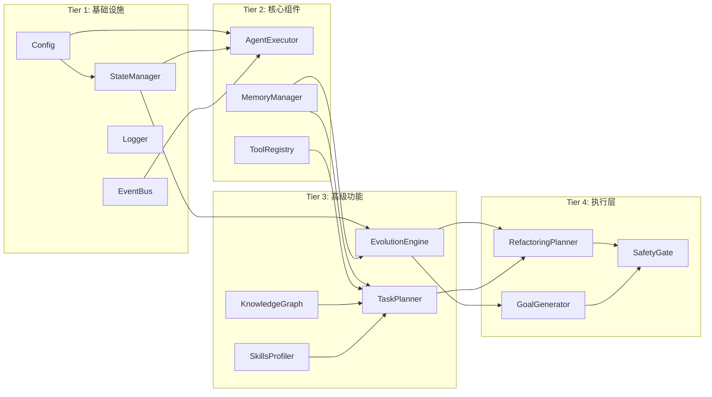
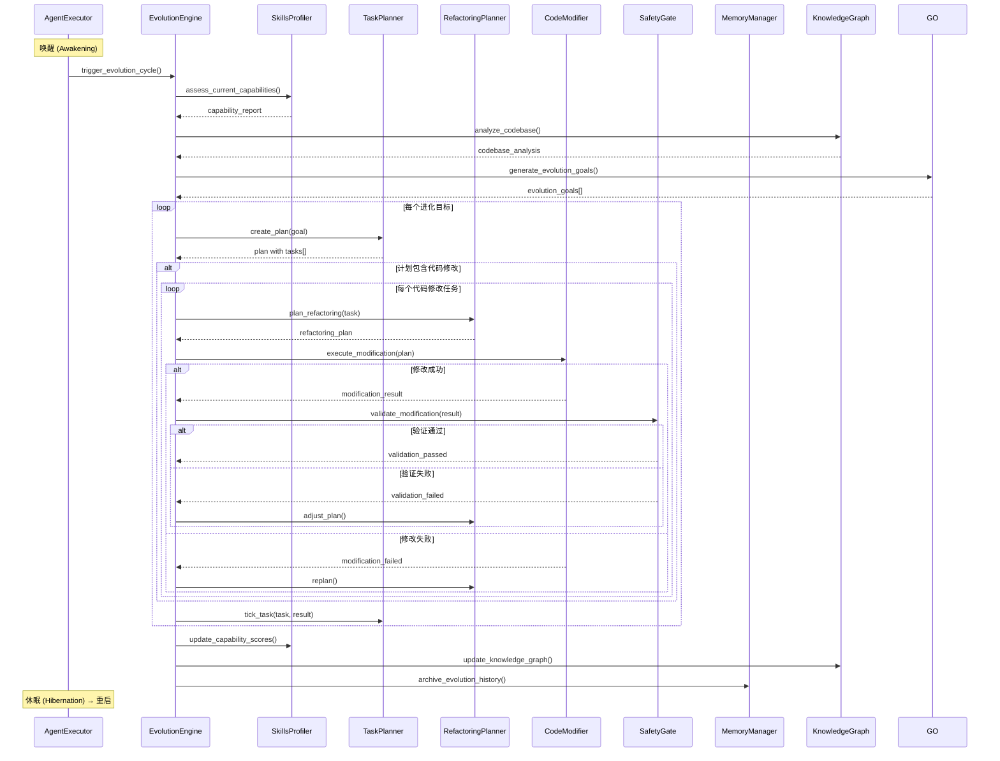

# 虾宝自我进化系统 - 详细技术设计文档

**版本：** v1.0  
**日期：** 2026-04-16  
**状态：** 技术设计阶段

---

## 目录

1. [系统架构总览](#1-系统架构总览)
2. [核心模块设计](#2-核心模块设计)
3. [数据模型设计](#3-数据模型设计)
4. [API 设计规范](#4-api-设计规范)
5. [事件与消息机制](#5-事件与消息机制)
6. [安全与权限系统](#6-安全与权限系统)
7. [错误处理与容错](#7-错误处理与容错)
8. [配置管理](#8-配置管理)
9. [测试策略](#9-测试策略)
10. [部署指南](#10-部署指南)

---

## 1. 系统架构总览

### 1.1 整体架构图

```mermaid
flowchart TB
    subgraph Core["核心层 (core/)"]
        AE["AgentExecutor<br/>Agent执行器"]
        EE["EvolutionEngine<br/>进化引擎"]
        SM["StateManager<br/>状态管理"]
        EB["EventBus<br/>事件总线"]
        LG["Logger<br/>日志系统"]
    end

    subgraph Memory["记忆层 (memory/)"]
        MM["MemoryManager<br/>记忆管理器"]
        KG["KnowledgeGraph<br/>知识图谱"]
        SP["SkillsProfiler<br/>能力画像"]
        EL["ExperienceLibrary<br/>经验库"]
    end

    subgraph Planning["规划层 (planning/)"]
        TP["TaskPlanner<br/>任务规划器"]
        RP["RefactoringPlanner<br/>重构规划器"]
        RR["RiskEvaluator<br/>风险评估器"]
        GO["GoalGenerator<br/>目标生成器"]
    end

    subgraph Tools["工具层 (tools/)"]
        TR["ToolRegistry<br/>工具注册表"]
        BT["BaseTools<br/>基础工具集"]
        PT["PluginTools<br/>插件工具集"]
        CT["CompositeTools<br/>复合工具集"]
    end

    subgraph Safety["安全层 (safety/)"]
        SG["SafetyGate<br/>安全门控"]
        VA["Validator<br/>验证器"]
        BK["BackupManager<br/>备份管理"]
        RL["RollbackManager<br/>回滚管理"]
    end

    subgraph LLM["LLM层"]
        LLM["LanguageModel<br/>大语言模型"]
        CP["CompressionLLM<br/>压缩LLM"]
    end

    subgraph External["外部接口"]
        API["REST API"]
        CLI["CLI Interface"]
        WS["WebSocket"]
    end

    AE --> EE
    AE --> MM
    EE --> TP
    EE --> RP
    EE --> KG
    TP --> TR
    TP --> RR
    RP --> TR
    RP --> BK
    SG --> RL
    SG --> VA
    AE --> LLM
    AE --> CP
    AE --> SG
    MM --> KG
    MM --> SP
    MM --> EL
    TR --> BT
    TR --> PT
    TR --> CT
    API --> AE
    CLI --> AE
    WS --> AE
```

### 1.2 模块依赖关系



### 1.3 进化循环流程



---

## 2. 核心模块设计

### 2.1 AgentExecutor (Agent执行器)

**文件：** `core/agent_executor.py`

```python
class AgentExecutor:
    """
    Agent 执行器 - 负责协调所有组件执行任务

    职责：
    1. 管理对话循环
    2. 调用 LLM 进行推理
    3. 执行工具调用
    4. 处理上下文压缩
    5. 管理 Agent 状态
    """

    def __init__(
        self,
        config: Config,
        llm: ChatOpenAI,
        tools: List[BaseTool],
        memory_manager: MemoryManager,
        evolution_engine: EvolutionEngine,
        safety_gate: SafetyGate,
    ):
        """初始化 Agent 执行器"""

    # ==================== 核心方法 ====================

    def run_loop(
        self,
        initial_prompt: Optional[str] = None,
        max_iterations: Optional[int] = None,
    ) -> RunResult:
        """
        运行 Agent 主循环

        Args:
            initial_prompt: 初始提示词
            max_iterations: 最大迭代次数

        Returns:
            RunResult: 运行结果
        """

    def think_and_act(self, user_prompt: str) -> ThinkAndActResult:
        """
        单次思考-行动循环

        流程：
        1. 构建系统提示词
        2. 调用 LLM
        3. 解析工具调用
        4. 执行工具
        5. 返回结果
        """

    def _invoke_llm(
        self,
        messages: List[BaseMessage],
        tools: Optional[List[BaseTool]] = None,
    ) -> LLMResponse:
        """调用 LLM，带超时控制"""

    def _execute_tool(
        self,
        tool_call: ToolCall,
        context: ExecutionContext,
    ) -> ToolResult:
        """执行单个工具调用"""

    # ==================== 上下文管理 ====================

    def _check_and_compress(
        self,
        messages: List[BaseMessage],
        iteration: int,
    ) -> List[BaseMessage]:
        """检查 Token 预算，必要时压缩"""

    def _compress_context(
        self,
        messages: List[BaseMessage],
    ) -> List[BaseMessage]:
        """执行上下文压缩"""

    # ==================== 状态管理 ====================

    def get_state(self) -> AgentState:
        """获取当前状态"""

    def set_state(
        self,
        state: AgentState,
        action: Optional[str] = None,
    ) -> None:
        """设置状态"""

    # ==================== 进化集成 ====================

    def trigger_evolution(
        self,
        reason: EvolutionReason,
    ) -> EvolutionResult:
        """触发进化流程"""

    def on_evolution_complete(
        self,
        result: EvolutionResult,
    ) -> None:
        """进化完成回调"""
```

**API 接口：**

| 方法 | 签名 | 说明 |
|------|------|------|
| `run_loop` | `(initial_prompt?, max_iterations?) → RunResult` | 运行主循环 |
| `think_and_act` | `(user_prompt) → ThinkAndActResult` | 单次思考-行动 |
| `invoke_llm` | `(messages, tools?) → LLMResponse` | 调用 LLM |
| `execute_tool` | `(tool_call, context) → ToolResult` | 执行工具 |
| `compress_context` | `(messages) → List[BaseMessage]` | 压缩上下文 |
| `get_state` | `() → AgentState` | 获取状态 |
| `trigger_evolution` | `(reason) → EvolutionResult` | 触发进化 |

### 2.2 EvolutionEngine (进化引擎)

**文件：** `core/evolution_engine.py`

```python
from dataclasses import dataclass, field
from typing import List, Optional, Dict, Any, Callable
from enum import Enum, auto

class EvolutionPhase(Enum):
    """进化阶段"""
    SELF_ANALYSIS = auto()      # 自我分析
    GOAL_GENERATION = auto()    # 目标生成
    PLANNING = auto()           # 规划
    EXECUTION = auto()          # 执行
    VALIDATION = auto()         # 验证
    ARCHIVATION = auto()        # 归档

@dataclass
class EvolutionGoal:
    """进化目标"""
    id: str
    title: str
    description: str
    priority: int  # 1-5, 1 最高
    category: GoalCategory
    target_capabilities: Dict[str, float]  # 目标能力提升
    estimated_effort: str  # 如 "2h", "1d"
    risk_level: RiskLevel
    success_criteria: List[str]
    prerequisite_goals: List[str] = field(default_factory=list)

@dataclass
class EvolutionPlan:
    """进化计划"""
    goal: EvolutionGoal
    tasks: List[EvolutionTask]
    timeline: List[TimelineItem]
    risk_assessment: RiskAssessment
    rollback_plan: RollbackPlan
    estimated_duration: str

@dataclass
class EvolutionTask:
    """进化任务"""
    id: str
    name: str
    description: str
    task_type: TaskType  # ANALYZE, MODIFY, TEST, DOCUMENT
    dependencies: List[str]
    tools_required: List[str]
    estimated_time: str
    risk: RiskLevel
    verification_method: VerificationMethod
    code_changes: Optional[List[CodeChange]] = None

@dataclass
class EvolutionResult:
    """进化结果"""
    success: bool
    phase: EvolutionPhase
    goal: EvolutionGoal
    completed_tasks: List[EvolutionTask]
    failed_tasks: List[EvolutionTask]
    capability_improvement: Dict[str, float]
    knowledge_graph_updates: List[KGUpdate]
    archive_data: Dict[str, Any]
    execution_time: float
    errors: List[EvolutionError]


class EvolutionEngine:
    """
    进化引擎 - 负责管理 Agent 的自我进化流程

    核心职责：
    1. 自我分析 - 评估当前能力状态
    2. 目标生成 - 识别改进机会并生成目标
    3. 规划制定 - 创建详细的执行计划
    4. 执行监控 - 跟踪和管理进化执行
    5. 结果验证 - 确保进化达到预期效果
    6. 归档整理 - 保存进化经验和知识
    """

    def __init__(
        self,
        config: Config,
        self_analyzer: SelfAnalyzer,
        goal_generator: GoalGenerator,
        task_planner: TaskPlanner,
        code_modifier: CodeModifier,
        safety_gate: SafetyGate,
        memory_manager: MemoryManager,
        knowledge_graph: KnowledgeGraph,
        skills_profiler: SkillsProfiler,
    ):
        """初始化进化引擎"""

    # ==================== 核心进化流程 ====================

    async def run_evolution_cycle(
        self,
        context: EvolutionContext,
    ) -> EvolutionResult:
        """
        运行完整的进化周期

        流程：
        1. 自我分析 (SELF_ANALYSIS)
        2. 目标生成 (GOAL_GENERATION)
        3. 规划 (PLANNING)
        4. 执行 (EXECUTION)
        5. 验证 (VALIDATION)
        6. 归档 (ARCHIVATION)

        Args:
            context: 进化上下文

        Returns:
            EvolutionResult: 进化结果
        """

    async def _phase_self_analysis(
        self,
        context: EvolutionContext,
    ) -> SelfAnalysisReport:
        """阶段 1: 自我分析"""

    async def _phase_goal_generation(
        self,
        context: EvolutionContext,
        analysis: SelfAnalysisReport,
    ) -> List[EvolutionGoal]:
        """阶段 2: 目标生成"""

    async def _phase_planning(
        self,
        context: EvolutionContext,
        goals: List[EvolutionGoal],
    ) -> List[EvolutionPlan]:
        """阶段 3: 规划"""

    async def _phase_execution(
        self,
        context: EvolutionContext,
        plan: EvolutionPlan,
    ) -> ExecutionResult:
        """阶段 4: 执行"""

    async def _phase_validation(
        self,
        context: EvolutionContext,
        execution: ExecutionResult,
    ) -> ValidationResult:
        """阶段 5: 验证"""

    async def _phase_archivization(
        self,
        context: EvolutionContext,
        result: EvolutionResult,
    ) -> ArchiveResult:
        """阶段 6: 归档"""

    # ==================== 目标管理 ====================

    def add_goal(self, goal: EvolutionGoal) -> str:
        """添加进化目标"""

    def prioritize_goals(
        self,
        goals: List[EvolutionGoal],
    ) -> List[EvolutionGoal]:
        """对目标进行优先级排序"""

    def validate_goal(self, goal: EvolutionGoal) -> GoalValidationResult:
        """验证目标的有效性"""

    # ==================== 计划管理 ====================

    def create_plan(
        self,
        goal: EvolutionGoal,
        options: PlanOptions,
    ) -> EvolutionPlan:
        """为目标创建执行计划"""

    def adjust_plan(
        self,
        plan: EvolutionPlan,
        feedback: PlanFeedback,
    ) -> EvolutionPlan:
        """根据反馈调整计划"""

    def estimate_plan_risk(
        self,
        plan: EvolutionPlan,
    ) -> RiskAssessment:
        """评估计划风险"""

    # ==================== 执行控制 ====================

    async def execute_task(
        self,
        task: EvolutionTask,
        context: ExecutionContext,
    ) -> TaskExecutionResult:
        """执行单个任务"""

    async def execute_code_modification(
        self,
        change: CodeChange,
        context: ExecutionContext,
    ) -> ModificationResult:
        """执行代码修改"""

    def pause_evolution(self) -> None:
        """暂停进化"""

    def resume_evolution(self) -> None:
        """恢复进化"""

    def abort_evolution(self, reason: str) -> None:
        """中止进化"""

    # ==================== 状态查询 ====================

    def get_evolution_status(self) -> EvolutionStatus:
        """获取进化状态"""

    def get_current_phase(self) -> EvolutionPhase:
        """获取当前阶段"""

    def get_progress(self) -> EvolutionProgress:
        """获取进度"""

    # ==================== 事件发布 ====================

    def subscribe_to_phase(
        self,
        phase: EvolutionPhase,
        callback: Callable[[PhaseEvent], None],
    ) -> Subscription:
        """订阅阶段事件"""

    def subscribe_to_task(
        self,
        task_id: str,
        callback: Callable[[TaskEvent], None],
    ) -> Subscription:
        """订阅任务事件"""

    # ==================== 历史管理 ====================

    def get_evolution_history(
        self,
        limit: Optional[int] = None,
    ) -> List[EvolutionHistoryItem]:
        """获取进化历史"""

    def replay_evolution(
        self,
        evolution_id: str,
    ) -> EvolutionReplay:
        """回放历史进化"""
```

**API 接口：**

| 方法 | 签名 | 说明 |
|------|------|------|
| `run_evolution_cycle` | `(context) → EvolutionResult` | 运行完整进化周期 |
| `_phase_self_analysis` | `(context) → SelfAnalysisReport` | 自我分析阶段 |
| `_phase_goal_generation` | `(context, analysis) → List[EvolutionGoal]` | 目标生成阶段 |
| `_phase_planning` | `(context, goals) → List[EvolutionPlan]` | 规划阶段 |
| `_phase_execution` | `(context, plan) → ExecutionResult` | 执行阶段 |
| `_phase_validation` | `(context, execution) → ValidationResult` | 验证阶段 |
| `_phase_archivization` | `(context, result) → ArchiveResult` | 归档阶段 |
| `add_goal` | `(goal) → str` | 添加目标 |
| `prioritize_goals` | `(goals) → List[EvolutionGoal]` | 目标排序 |
| `create_plan` | `(goal, options) → EvolutionPlan` | 创建计划 |
| `execute_task` | `(task, context) → TaskExecutionResult` | 执行任务 |
| `pause_evolution` | `() → None` | 暂停进化 |
| `abort_evolution` | `(reason) → None` | 中止进化 |
| `get_evolution_status` | `() → EvolutionStatus` | 获取状态 |

### 2.3 SelfAnalyzer (自我分析器)

**文件：** `core/self_analyzer.py`

```python
@dataclass
class CapabilityScore:
    """能力评分"""
    dimension: CapabilityDimension
    score: float  # 0.0 - 1.0
    evidence: List[str]
    weakness: List[str]
    trend: Trend  # IMPROVING, STABLE, DECLINING
    last_updated: datetime

@dataclass
class CodeAnalysis:
    """代码分析结果"""
    file: str
    metrics: CodeMetrics
    issues: List[CodeIssue]
    hotspots: List[CodeHotspot]
    dependencies: List[str]

@dataclass
class CodeMetrics:
    """代码指标"""
    lines_of_code: int
    cyclomatic_complexity: float
    cognitive_complexity: float
    maintainability_index: float
    duplication_rate: float
    test_coverage: float
    doc_coverage: float
    type_annotation_rate: float

@dataclass
class SelfAnalysisReport:
    """自我分析报告"""
    generation: int
    timestamp: datetime
    capabilities: List[CapabilityScore]
    overall_score: float
    strengths: List[str]
    weaknesses: List[str]
    improvement_opportunities: List[ImprovementOpportunity]
    code_analysis: List[CodeAnalysis]
    tool_usage_stats: ToolUsageStats
    task_completion_stats: TaskCompletionStats
    recommendations: List[str]


class SelfAnalyzer:
    """
    自我分析器 - 评估 Agent 的当前状态和能力

    分析维度：
    1. 能力评估 - 六大能力维度评分
    2. 代码分析 - 代码质量指标
    3. 工具使用 - 工具使用效率分析
    4. 任务完成 - 任务完成情况统计
    5. 模式识别 - 识别成功/失败模式
    """

    def __init__(
        self,
        config: Config,
        knowledge_graph: KnowledgeGraph,
        memory_manager: MemoryManager,
    ):
        """初始化自我分析器"""

    # ==================== 能力评估 ====================

    async def assess_capabilities(
        self,
        context: Optional[AnalysisContext] = None,
    ) -> List[CapabilityScore]:
        """
        评估六大能力维度

        维度定义：
        - code_quality: 代码质量
        - tool_power: 工具能力
        - learning: 学习能力
        - planning: 规划能力
        - autonomy: 自主性
        - memory: 记忆能力
        """

    def _assess_code_quality(
        self,
        evidence: List[Evidence],
    ) -> CapabilityScore:
        """评估代码质量"""

    def _assess_tool_power(
        self,
        evidence: List[Evidence],
    ) -> CapabilityScore:
        """评估工具能力"""

    def _assess_learning(
        self,
        evidence: List[Evidence],
    ) -> CapabilityScore:
        """评估学习能力"""

    def _assess_planning(
        self,
        evidence: List[Evidence],
    ) -> CapabilityScore:
        """评估规划能力"""

    def _assess_autonomy(
        self,
        evidence: List[Evidence],
    ) -> CapabilityScore:
        """评估自主性"""

    def _assess_memory(
        self,
        evidence: List[Evidence],
    ) -> CapabilityScore:
        """评估记忆能力"""

    # ==================== 代码分析 ====================

    async def analyze_codebase(
        self,
        scope: Optional[List[str]] = None,
    ) -> List[CodeAnalysis]:
        """
        分析代码库

        分析内容：
        1. 代码复杂度
        2. 重复代码
        3. 测试覆盖
        4. 文档完整性
        5. 依赖关系
        6. 修改频率（热点）
        """

    def analyze_file(
        self,
        file_path: str,
    ) -> CodeAnalysis:
        """分析单个文件"""

    def calculate_complexity(
        self,
        file_path: str,
    ) -> CodeMetrics:
        """计算代码复杂度"""

    def find_code_smells(
        self,
        file_path: str,
    ) -> List[CodeIssue]:
        """查找代码异味"""

    def identify_hotspots(
        self,
    ) -> List[CodeHotspot]:
        """识别代码热点（频繁修改区域）"""

    # ==================== 工具分析 ====================

    async def analyze_tool_usage(
        self,
        time_window: Optional[TimeWindow] = None,
    ) -> ToolUsageStats:
        """
        分析工具使用情况

        统计指标：
        - 每个工具的使用频率
        - 成功率/失败率
        - 平均执行时间
        - 最常用工具组合
        - 最失败工具列表
        """

    def get_tool_success_rate(
        self,
        tool_name: str,
    ) -> float:
        """获取工具成功率"""

    def get_tool_patterns(
        self,
        task_type: str,
    ) -> List[ToolPattern]:
        """获取任务类型的工具使用模式"""

    # ==================== 任务分析 ====================

    async def analyze_task_completion(
        self,
        time_window: Optional[TimeWindow] = None,
    ) -> TaskCompletionStats:
        """
        分析任务完成情况

        统计指标：
        - 任务完成率
        - 平均完成时间
        - 超时任务比例
        - 失败任务原因分布
        - 子任务依赖分析
        """

    def identify_task_patterns(
        self,
    ) -> List[TaskPattern]:
        """识别任务模式"""

    # ==================== 综合分析 ====================

    async def generate_analysis_report(
        self,
        generation: int,
    ) -> SelfAnalysisReport:
        """
        生成完整的自我分析报告
        """

    def compare_with_previous(
        self,
        current: SelfAnalysisReport,
        previous: SelfAnalysisReport,
    ) -> ComparisonResult:
        """与上一次分析对比"""

    # ==================== 改进机会识别 ====================

    def identify_improvement_opportunities(
        self,
        analysis: SelfAnalysisReport,
    ) -> List[ImprovementOpportunity]:
        """
        识别改进机会

        基于：
        1. 能力短板（评分最低的维度）
        2. 代码热点（频繁修改的区域）
        3. 工具弱点（使用效果差的工具）
        4. 任务瓶颈（经常失败的任务类型）
        """
```

**API 接口：**

| 方法 | 签名 | 说明 |
|------|------|------|
| `assess_capabilities` | `(context?) → List[CapabilityScore]` | 评估能力 |
| `analyze_codebase` | `(scope?) → List[CodeAnalysis]` | 分析代码库 |
| `analyze_file` | `(file_path) → CodeAnalysis` | 分析单文件 |
| `analyze_tool_usage` | `(time_window?) → ToolUsageStats` | 分析工具使用 |
| `analyze_task_completion` | `(time_window?) → TaskCompletionStats` | 分析任务完成 |
| `generate_analysis_report` | `(generation) → SelfAnalysisReport` | 生成分析报告 |
| `identify_improvement_opportunities` | `(analysis) → List[ImprovementOpportunity]` | 识别改进机会 |

### 2.4 GoalGenerator (目标生成器)

**文件：** `core/goal_generator.py`

```python
class GoalCategory(Enum):
    """目标类别"""
    CODE_QUALITY = auto()       # 代码质量
    ARCHITECTURE = auto()       # 架构优化
    TOOL_ENHANCEMENT = auto()   # 工具增强
    LEARNING = auto()           # 学习能力
    AUTONOMY = auto()           # 自主性
    MEMORY = auto()             # 记忆系统
    PERFORMANCE = auto()        # 性能优化
    DOCUMENTATION = auto()       # 文档完善
    TESTING = auto()            # 测试覆盖

class GoalGenerator:
    """
    目标生成器 - 基于自我分析生成进化目标

    生成逻辑：
    1. 分析能力短板 → 生成针对性改进目标
    2. 分析代码热点 → 生成重构优化目标
    3. 分析任务瓶颈 → 生成能力提升目标
    4. 参考 SOUL.md 使命 → 确保方向正确
    5. 结合历史进化 → 避免重复和退化
    """

    def __init__(
        self,
        config: Config,
        self_analyzer: SelfAnalyzer,
        knowledge_graph: KnowledgeGraph,
        soul_reader: SoulReader,
    ):
        """初始化目标生成器"""

    async def generate_goals(
        self,
        analysis: SelfAnalysisReport,
        mission: Mission,
        constraints: List[Constraint],
    ) -> List[EvolutionGoal]:
        """
        生成进化目标列表

        生成策略：
        1. 短板导向 - 优先改进评分最低的能力
        2. 影响导向 - 选择影响最大的改进点
        3. 可行导向 - 确保目标可实现
        4. 渐进导向 - 每次改进一小步
        """

    def generate_code_quality_goals(
        self,
        analysis: SelfAnalysisReport,
    ) -> List[EvolutionGoal]:
        """生成代码质量目标"""

    def generate_architecture_goals(
        self,
        analysis: SelfAnalysisReport,
    ) -> List[EvolutionGoal]:
        """生成架构优化目标"""

    def generate_tool_enhancement_goals(
        self,
        analysis: SelfAnalysisReport,
    ) -> List[EvolutionGoal]:
        """生成工具增强目标"""

    def generate_learning_goals(
        self,
        analysis: SelfAnalysisReport,
    ) -> List[EvolutionGoal]:
        """生成学习能力目标"""

    def generate_autonomy_goals(
        self,
        analysis: SelfAnalysisReport,
    ) -> List[EvolutionGoal]:
        """生成自主性目标"""

    def generate_memory_goals(
        self,
        analysis: SelfAnalysisReport,
    ) -> List[EvolutionGoal]:
        """生成记忆系统目标"""

    def validate_goal(
        self,
        goal: EvolutionGoal,
        constraints: List[Constraint],
    ) -> GoalValidationResult:
        """
        验证目标有效性

        SMART 原则检查：
        - S: Specific - 具体可定义
        - M: Measurable - 可衡量
        - A: Achievable - 可实现
        - R: Relevant - 与使命相关
        - T: Time-bound - 有时限
        """

    def estimate_goal_difficulty(
        self,
        goal: EvolutionGoal,
    ) -> DifficultyEstimate:
        """评估目标难度"""

    def suggest_goal_refinements(
        self,
        goal: EvolutionGoal,
    ) -> List[str]:
        """建议目标优化方向"""
```

**API 接口：**

| 方法 | 签名 | 说明 |
|------|------|------|
| `generate_goals` | `(analysis, mission, constraints) → List[EvolutionGoal]` | 生成目标列表 |
| `generate_X_goals` | `(analysis) → List[EvolutionGoal]` | 生成各类目标 |
| `validate_goal` | `(goal, constraints) → GoalValidationResult` | 验证目标 |
| `estimate_goal_difficulty` | `(goal) → DifficultyEstimate` | 评估难度 |

### 2.5 TaskPlanner (任务规划器)

**文件：** `core/task_planner.py`

```python
class TaskType(Enum):
    """任务类型"""
    ANALYZE = auto()        # 分析类
    MODIFY = auto()          # 修改类
    TEST = auto()            # 测试类
    DOCUMENT = auto()        # 文档类
    REFACTOR = auto()        # 重构类
    CREATE = auto()          # 创建类
    DELETE = auto()          # 删除类
    REVIEW = auto()          # 审查类

class TaskStatus(Enum):
    """任务状态"""
    PENDING = auto()         # 待执行
    IN_PROGRESS = auto()     # 执行中
    COMPLETED = auto()       # 已完成
    FAILED = auto()          # 失败
    SKIPPED = auto()         # 跳过
    BLOCKED = auto()         # 阻塞

@dataclass
class TaskDependency:
    """任务依赖"""
    task_id: str
    dependency_type: DependencyType  # BLOCKS, REQUIRES, ENHANCES
    optional: bool = False

@dataclass
class TaskPlan:
    """任务计划"""
    id: str
    goal_id: str
    name: str
    description: str
    tasks: List[PlannedTask]
    total_estimated_time: str
    risk_level: RiskLevel
    prerequisite_skills: List[str]
    success_criteria: List[str]
    fallback_plan: Optional[str]

@dataclass
class PlannedTask:
    """规划任务"""
    id: str
    name: str
    description: str
    task_type: TaskType
    dependencies: List[TaskDependency]
    tools_required: List[str]
    estimated_time: str
    risk_level: RiskLevel
    verification_method: VerificationMethod
    code_changes: Optional[List[CodeChangeSpec]] = None
    rollback_action: Optional[str] = None


class TaskPlanner:
    """
    任务规划器 - 将目标分解为可执行的任务

    功能：
    1. 目标分解 - 将大目标分解为小任务
    2. 依赖分析 - 识别任务间依赖关系
    3. 资源规划 - 确定所需工具和技能
    4. 风险评估 - 评估任务风险等级
    5. 时间估算 - 估算任务完成时间
    6. 计划调整 - 根据执行情况动态调整
    """

    def __init__(
        self,
        config: Config,
        tool_registry: ToolRegistry,
        risk_evaluator: RiskEvaluator,
    ):
        """初始化任务规划器"""

    def create_plan(
        self,
        goal: EvolutionGoal,
        context: PlanningContext,
    ) -> TaskPlan:
        """
        为目标创建任务计划

        分解策略：
        1. 按功能分解 - 按业务功能拆分
        2. 按层次分解 - 先框架后细节
        3. 按风险分解 - 高风险先验证
        4. 按依赖分解 - 被依赖的先完成
        """

    def decompose_goal(
        self,
        goal: EvolutionGoal,
    ) -> List[PlannedTask]:
        """
        分解目标为任务

        分解原则：
        - 每个任务应该是原子性的（不可再分）
        - 每个任务有明确的完成标准
        - 任务间依赖关系清晰
        """

    def analyze_dependencies(
        self,
        tasks: List[PlannedTask],
    ) -> DependencyGraph:
        """
        分析任务依赖关系

        输出：
        - 依赖图（DAG）
        - 关键路径
        - 可并行任务组
        """

    def identify_parallel_tasks(
        self,
        tasks: List[PlannedTask],
    ) -> List[List[str]]:
        """
        识别可并行执行的任务组

        返回：
        List[List[str]] - 每组内的任务可以并行执行
        """

    def estimate_task_time(
        self,
        task: PlannedTask,
        historical_data: Optional[TaskHistory] = None,
    ) -> TimeEstimate:
        """
        估算任务时间

        参考：
        - 历史类似任务耗时
        - 任务复杂度评估
        - 工具平均执行时间
        """

    def assess_task_risk(
        self,
        task: PlannedTask,
    ) -> RiskAssessment:
        """
        评估任务风险

        风险因素：
        - 修改范围（影响文件数）
        - 修改类型（新增/修改/删除）
        - 涉及模块（核心/边缘）
        - 依赖数量
        - 回滚难度
        """

    def create_verification_plan(
        self,
        task: PlannedTask,
    ) -> VerificationPlan:
        """
        创建验证计划

        验证方法：
        - 语法检查
        - 单元测试
        - 集成测试
        - 功能测试
        - 手动验证
        """

    def adjust_plan(
        self,
        plan: TaskPlan,
        feedback: ExecutionFeedback,
    ) -> TaskPlan:
        """
        根据执行反馈调整计划

        调整策略：
        - 任务失败 → 分析原因，调整或跳过
        - 时间超限 → 拆分任务，增加缓冲
        - 发现新依赖 → 补充依赖关系
        """

    def prioritize_tasks(
        self,
        tasks: List[PlannedTask],
        strategy: PrioritizationStrategy,
    ) -> List[PlannedTask]:
        """
        任务优先级排序

        策略：
        - RISK_FIRST - 风险高的先做
        - DEPENDENCY_FIRST - 依赖多的先做
        - EFFORT_FIRST - 简单的先做
        - VALUE_FIRST - 价值大的先做
        """

    def validate_plan(
        self,
        plan: TaskPlan,
    ) -> PlanValidationResult:
        """
        验证计划完整性

        检查项：
        - 无循环依赖
        - 所有依赖都有来源
        - 验证方法都已定义
        - 回滚方案都已准备
        """
```

**API 接口：**

| 方法 | 签名 | 说明 |
|------|------|------|
| `create_plan` | `(goal, context) → TaskPlan` | 创建任务计划 |
| `decompose_goal` | `(goal) → List[PlannedTask]` | 分解目标 |
| `analyze_dependencies` | `(tasks) → DependencyGraph` | 分析依赖 |
| `identify_parallel_tasks` | `(tasks) → List[List[str]]` | 识别并行任务 |
| `estimate_task_time` | `(task, history?) → TimeEstimate` | 估算时间 |
| `assess_task_risk` | `(task) → RiskAssessment` | 评估风险 |
| `create_verification_plan` | `(task) → VerificationPlan` | 创建验证计划 |
| `adjust_plan` | `(plan, feedback) → TaskPlan` | 调整计划 |
| `prioritize_tasks` | `(tasks, strategy) → List[PlannedTask]` | 优先级排序 |
| `validate_plan` | `(plan) → PlanValidationResult` | 验证计划 |

### 2.6 CodeModifier (代码修改器)

**文件：** `core/code_modifier.py`

```python
class ModificationStrategy(Enum):
    """代码修改策略"""
    DIFF_EDIT = auto()      # Diff 编辑（局部修改）
    FILE_REWRITE = auto()   # 文件重写（整体替换）
    MODULAR_PLUGIN = auto() # 模块化插件（新文件）
    CODE_GENERATION = auto()# 代码生成（新代码块）

@dataclass
class CodeChange:
    """代码变更"""
    id: str
    strategy: ModificationStrategy
    target_file: str
    change_type: ChangeType  # ADD, MODIFY, DELETE
    content: str  # 新内容或 diff
    search_content: Optional[str] = None  # 用于定位
    context_lines: List[str] = field(default_factory=list)
    validation_method: ValidationMethod
    rollback_content: Optional[str] = None

@dataclass
class ModificationResult:
    """修改结果"""
    success: bool
    change_id: str
    file_path: str
    lines_modified: int
    validation_result: ValidationResult
    backup_path: Optional[str]
    error: Optional[str]
    execution_time: float

@dataclass
class CodeChangeSpec:
    """代码变更规范"""
    file_path: str
    change_type: ChangeType
    description: str
    content: str
    search_pattern: Optional[str] = None
    allow_fuzzy: bool = False
    create_backup: bool = True


class CodeModifier:
    """
    代码修改器 - 执行具体的代码变更

    支持的修改策略：
    1. Diff 编辑 - 精确定位修改
    2. 文件重写 - 整体替换
    3. 模块化插件 - 新增文件
    4. 代码生成 - 生成新代码块
    """

    def __init__(
        self,
        config: Config,
        backup_manager: BackupManager,
        validator: CodeValidator,
        security_validator: SecurityValidator,
    ):
        """初始化代码修改器"""

    # ==================== 修改执行 ====================

    async def execute_modification(
        self,
        change: CodeChange,
        context: ModificationContext,
    ) -> ModificationResult:
        """
        执行代码修改

        流程：
        1. 安全检查
        2. 创建备份
        3. 执行修改
        4. 语法验证
        5. 功能验证（可选）
        6. 提交或回滚
        """

    def select_strategy(
        self,
        change_scope: int,
        change_type: ChangeType,
        risk_level: RiskLevel,
    ) -> ModificationStrategy:
        """
        选择修改策略

        决策矩阵：
        | 范围 | 类型 | 风险 | 策略 |
        |------|------|------|------|
        | 小(<50行) | 修改 | 低 | DIFF_EDIT |
        | 小(<50行) | 修改 | 中/高 | DIFF_EDIT |
        | 大(>50行) | 修改 | 低 | DIFF_EDIT |
        | 大(>50行) | 修改 | 中/高 | FILE_REWRITE |
        | 任何 | 新增 | 任何 | CODE_GENERATION |
        | 任何 | 删除 | 任何 | DIFF_EDIT |
        """

    # ==================== Diff 编辑 ====================

    async def apply_diff_edit(
        self,
        file_path: str,
        diff_text: str,
        allow_fuzzy: bool = False,
    ) -> ModificationResult:
        """
        应用 Diff 编辑

        支持格式：
        1. Unified Diff
        2. Cursor/Aider Diff Block
        3. Git Diff

        返回：
        - 成功/失败状态
        - 修改行数
        - 验证结果
        """

    def parse_diff_block(
        self,
        diff_text: str,
    ) -> DiffBlock:
        """
        解析 Diff Block

        支持格式：
        <<<<<<< SEARCH
        old code
        =======
        new code
        >>>>>>> REPLACE
        """

    # ==================== 文件重写 ====================

    async def rewrite_file(
        self,
        file_path: str,
        new_content: str,
        preserve_metadata: bool = True,
    ) -> ModificationResult:
        """
        重写整个文件

        参数：
        - file_path: 目标文件路径
        - new_content: 新内容
        - preserve_metadata: 是否保留元数据（权限、时间戳）
        """

    # ==================== 模块化插件 ====================

    async def create_plugin(
        self,
        plugin_spec: PluginSpec,
    ) -> ModificationResult:
        """
        创建插件模块

        参数：
        - plugin_spec: 插件规范

        输出：
        - 新文件路径
        - 插件注册信息
        """

    def register_plugin(
        self,
        plugin_path: str,
        metadata: PluginMetadata,
    ) -> bool:
        """
        注册插件到工具注册表
        """

    # ==================== 代码生成 ====================

    async def generate_code(
        self,
        spec: CodeGenerationSpec,
    ) -> ModificationResult:
        """
        根据规范生成代码

        参数：
        - spec: 代码生成规范
          - file_path: 目标路径
          - template: 模板类型
          - parameters: 模板参数
          - imports: 需要的导入
          - docstring: 文档字符串
        """

    # ==================== 安全与备份 ====================

    async def _pre_modification_checks(
        self,
        change: CodeChange,
    ) -> PreCheckResult:
        """
        修改前安全检查

        检查项：
        1. 路径是否在允许范围内
        2. 是否为敏感文件
        3. 是否有语法错误
        4. 依赖是否满足
        """

    async def _create_backup(
        self,
        file_path: str,
    ) -> str:
        """
        创建文件备份

        备份策略：
        - 时间戳命名
        - 存储在 .backups 目录
        - 保留最近 N 个备份
        """

    async def _rollback(
        self,
        backup_path: str,
        original_path: str,
    ) -> bool:
        """
        回滚修改

        从备份恢复原文件
        """

    # ==================== 验证 ====================

    async def validate_modification(
        self,
        result: ModificationResult,
    ) -> ValidationResult:
        """
        验证修改结果

        验证层次：
        1. 语法验证 - Python AST 解析
        2. 导入验证 - 所有导入可解析
        3. 类型验证 - 类型注解正确（可选）
        4. 测试验证 - 相关测试通过（可选）
        """
```

**API 接口：**

| 方法 | 签名 | 说明 |
|------|------|------|
| `execute_modification` | `(change, context) → ModificationResult` | 执行修改 |
| `select_strategy` | `(scope, type, risk) → ModificationStrategy` | 选择策略 |
| `apply_diff_edit` | `(file, diff, fuzzy?) → ModificationResult` | Diff 编辑 |
| `rewrite_file` | `(file, content, preserve?) → ModificationResult` | 重写文件 |
| `create_plugin` | `(spec) → ModificationResult` | 创建插件 |
| `generate_code` | `(spec) → ModificationResult` | 生成代码 |
| `validate_modification` | `(result) → ValidationResult` | 验证修改 |

### 2.7 KnowledgeGraph (知识图谱)

**文件：** `core/knowledge_graph.py`

```python
class EntityType(Enum):
    """实体类型"""
    FILE = auto()
    FUNCTION = auto()
    CLASS = auto()
    METHOD = auto()
    VARIABLE = auto()
    MODULE = auto()
    TOOL = auto()
    TASK = auto()
    GOAL = auto()
    CONCEPT = auto()
    ERROR = auto()

class RelationType(Enum):
    """关系类型"""
    CONTAINS = auto()           # 包含
    DEFINES = auto()            # 定义
    CALLS = auto()              # 调用
    IMPORTS = auto()            # 导入
    DEPENDS_ON = auto()         # 依赖
    MODIFIES = auto()           # 修改
    SOLVES = auto()            # 解决
    CAUSES = auto()             # 导致
    RELATES_TO = auto()         # 相关
    IMPLEMENTS = auto()         # 实现
    INHERITS = auto()           # 继承
    USES_PATTERN = auto()       # 使用模式

@dataclass
class Entity:
    """实体"""
    id: str
    type: EntityType
    name: str
    properties: Dict[str, Any]
    metadata: EntityMetadata
    embedding: Optional[List[float]] = None

@dataclass
class Relation:
    """关系"""
    id: str
    source_id: str
    target_id: str
    type: RelationType
    properties: Dict[str, Any]
    weight: float = 1.0  # 关系强度

@dataclass
class GraphQuery:
    """图查询"""
    entity_filters: List[EntityFilter]
    relation_filters: List[RelationFilter]
    traversal: TraversalSpec
    aggregation: Optional[AggregationSpec]


class KnowledgeGraph:
    """
    知识图谱 - 存储和管理代码库的知识结构

    功能：
    1. 实体管理 - 添加、查询、更新、删除实体
    2. 关系管理 - 建立、查询、管理关系
    3. 语义搜索 - 基于嵌入向量的语义搜索
    4. 推理查询 - 基于关系的推理查询
    5. 图分析 - 识别模式、计算重要性
    """

    def __init__(
        self,
        config: Config,
        storage: GraphStorage,
        embedding_model: Optional[EmbeddingModel] = None,
    ):
        """初始化知识图谱"""

    # ==================== 实体管理 ====================

    def add_entity(
        self,
        entity: Entity,
    ) -> str:
        """
        添加实体

        实体类型：
        - FILE: 文件实体
        - FUNCTION: 函数实体
        - CLASS: 类实体
        - TOOL: 工具实体
        - TASK: 任务实体
        - GOAL: 目标实体
        - CONCEPT: 概念实体
        """

    def get_entity(
        self,
        entity_id: str,
    ) -> Optional[Entity]:
        """获取实体"""

    def update_entity(
        self,
        entity_id: str,
        updates: Dict[str, Any],
    ) -> Entity:
        """更新实体"""

    def delete_entity(
        self,
        entity_id: str,
    ) -> bool:
        """删除实体及其关系"""

    def find_entities(
        self,
        filters: List[EntityFilter],
    ) -> List[Entity]:
        """
        查找实体

        支持过滤：
        - type: 实体类型
        - name: 名称匹配
        - properties: 属性匹配
        - metadata: 元数据匹配
        """

    # ==================== 关系管理 ====================

    def add_relation(
        self,
        relation: Relation,
    ) -> str:
        """
        添加关系

        关系类型：
        - CONTAINS: A 包含 B
        - CALLS: A 调用 B
        - DEPENDS_ON: A 依赖 B
        - MODIFIES: A 修改 B
        - SOLVES: A 解决 B
        """

    def get_relations(
        self,
        entity_id: str,
        relation_type: Optional[RelationType] = None,
        direction: RelationDirection = RelationDirection.BOTH,
    ) -> List[Relation]:
        """获取实体的关系"""

    def delete_relation(
        self,
        relation_id: str,
    ) -> bool:
        """删除关系"""

    def find_relations(
        self,
        filters: List[RelationFilter],
    ) -> List[Relation]:
        """查找关系"""

    # ==================== 图查询 ====================

    def query(
        self,
        query: GraphQuery,
    ) -> QueryResult:
        """
        图查询

        支持：
        1. 实体过滤
        2. 关系过滤
        3. 图遍历（深度、广度）
        4. 聚合计算
        """

    def find_path(
        self,
        source_id: str,
        target_id: str,
        max_depth: int = 5,
    ) -> Optional[Path]:
        """
        查找两个实体间的路径

        用途：
        - 分析代码依赖链
        - 评估修改影响范围
        - 理解代码结构
        """

    def find_connected(
        self,
        entity_id: str,
        relation_types: List[RelationType],
        max_depth: int = 2,
    ) -> List[Entity]:
        """
        查找与实体相连的所有实体

        用途：
        - 分析影响范围
        - 识别相关模块
        - 查找相似实体
        """

    def get_subgraph(
        self,
        center_id: str,
        radius: int = 2,
    ) -> Subgraph:
        """
        获取子图

        以指定实体为中心，返回半径范围内的子图
        """

    # ==================== 语义搜索 ====================

    async def semantic_search(
        self,
        query: str,
        top_k: int = 10,
        entity_types: Optional[List[EntityType]] = None,
    ) -> List[SemanticSearchResult]:
        """
        语义搜索

        基于嵌入向量查找语义相似的实体
        """

    def add_embedding(
        self,
        entity_id: str,
        embedding: List[float],
    ) -> None:
        """为实体添加嵌入向量"""

    # ==================== 图分析 ====================

    def calculate_importance(
        self,
        entity_id: str,
    ) -> float:
        """
        计算实体重要性

        基于：
        - 入度（被依赖次数）
        - 出度（依赖数量）
        - 中心性
        - 修改频率
        """

    def find_patterns(
        self,
        pattern: GraphPattern,
    ) -> List[PatternMatch]:
        """
        查找图模式

        模式示例：
        - 星型模式（中心-周边）
        - 链式模式（A->B->C）
        - 环型模式（循环依赖）
        """

    def detect_cycles(
        self,
    ) -> List[List[str]]:
        """
        检测循环依赖

        返回所有环的实体 ID 列表
        """

    # ==================== 代码库同步 ====================

    async def sync_codebase(
        self,
        scope: Optional[List[str]] = None,
    ) -> SyncResult:
        """
        同步代码库到图谱

        分析并更新：
        - 文件结构
        - 函数/类定义
        - 导入关系
        - 调用关系
        """

    def update_from_analysis(
        self,
        analysis: CodeAnalysis,
    ) -> None:
        """从代码分析结果更新图谱"""
```

**API 接口：**

| 方法 | 签名 | 说明 |
|------|------|------|
| `add_entity` | `(entity) → str` | 添加实体 |
| `get_entity` | `(id) → Entity?` | 获取实体 |
| `update_entity` | `(id, updates) → Entity` | 更新实体 |
| `delete_entity` | `(id) → bool` | 删除实体 |
| `find_entities` | `(filters) → List[Entity]` | 查找实体 |
| `add_relation` | `(relation) → str` | 添加关系 |
| `get_relations` | `(id, type?, direction?) → List[Relation]` | 获取关系 |
| `query` | `(query) → QueryResult` | 图查询 |
| `find_path` | `(source, target, depth?) → Path?` | 查找路径 |
| `find_connected` | `(id, types, depth?) → List[Entity]` | 查找关联实体 |
| `semantic_search` | `(query, k, types?) → List[SearchResult]` | 语义搜索 |
| `calculate_importance` | `(id) → float` | 计算重要性 |
| `find_patterns` | `(pattern) → List[PatternMatch]` | 查找模式 |
| `detect_cycles` | `() → List[List[str]]` | 检测循环 |
| `sync_codebase` | `(scope?) → SyncResult` | 同步代码库 |

### 2.8 SkillsProfiler (能力画像)

**文件：** `core/skills_profiler.py`

```python
class CapabilityDimension(Enum):
    """能力维度"""
    CODE_QUALITY = auto()       # 代码质量
    TOOL_POWER = auto()        # 工具能力
    LEARNING = auto()          # 学习能力
    PLANNING = auto()          # 规划能力
    AUTONOMY = auto()          # 自主性
    MEMORY = auto()            # 记忆能力

@dataclass
class SkillLevel:
    """技能等级"""
    level: int  # 1-10
    score: float  # 0.0 - 1.0
    evidence: List[str]
    examples: List[str]
    last_demonstrated: datetime

@dataclass
class CapabilityProfile:
    """能力画像"""
    agent_id: str
    generation: int
    timestamp: datetime
    dimensions: Dict[CapabilityDimension, SkillLevel]
    overall_score: float
    strengths: List[str]
    weaknesses: List[str]
    growth_trajectory: List[ScoreSnapshot]

@dataclass
class ScoreSnapshot:
    """得分快照"""
    timestamp: datetime
    overall_score: float
    dimension_scores: Dict[CapabilityDimension, float]


class SkillsProfiler:
    """
    能力画像 - 追踪和评估 Agent 的能力成长

    功能：
    1. 能力评估 - 六大维度评分
    2. 成长追踪 - 历史得分对比
    3. 短板识别 - 评分最低的维度
    4. 优势分析 - 评分最高的维度
    5. 预测建议 - 基于成长趋势的建议
    """

    def __init__(
        self,
        config: Config,
        storage: ProfileStorage,
        self_analyzer: SelfAnalyzer,
    ):
        """初始化能力画像"""

    # ==================== 能力评估 ====================

    async def evaluate_capability(
        self,
        dimension: CapabilityDimension,
        context: EvaluationContext,
    ) -> SkillLevel:
        """
        评估单个能力维度

        评估方法：
        1. 收集证据（工具调用、任务完成、代码产出）
        2. 量化评分（基于规则的评分算法）
        3. 生成示例（成功案例）
        4. 确定等级（1-10 级）
        """

    async def evaluate_all(
        self,
        context: EvaluationContext,
    ) -> CapabilityProfile:
        """
        评估所有能力维度

        生成完整的能力画像
        """

    def calculate_overall_score(
        self,
        dimensions: Dict[CapabilityDimension, SkillLevel],
    ) -> float:
        """
        计算总体得分

        加权平均：
        - CODE_QUALITY: 20%
        - TOOL_POWER: 15%
        - LEARNING: 20%
        - PLANNING: 15%
        - AUTONOMY: 15%
        - MEMORY: 15%
        """

    # ==================== 成长追踪 ====================

    def record_snapshot(
        self,
        profile: CapabilityProfile,
    ) -> str:
        """记录能力快照"""

    def get_growth_trajectory(
        self,
        dimension: Optional[CapabilityDimension] = None,
        time_range: Optional[TimeRange] = None,
    ) -> List[ScoreSnapshot]:
        """获取成长轨迹"""

    def compare_with_previous(
        self,
        current: CapabilityProfile,
        previous_generation: int,
    ) -> GrowthComparison:
        """
        与上一代对比

        输出：
        - 各维度变化
        - 总体变化
        - 趋势判断
        """

    # ==================== 分析与建议 ====================

    def identify_strengths(
        self,
        profile: CapabilityProfile,
        threshold: float = 0.7,
    ) -> List[str]:
        """
        识别优势

        条件：评分 >= threshold
        """

    def identify_weaknesses(
        self,
        profile: CapabilityProfile,
        threshold: float = 0.5,
    ) -> List[str]:
        """
        识别短板

        条件：评分 < threshold
        """

    def generate_recommendations(
        self,
        profile: CapabilityProfile,
    ) -> List[Recommendation]:
        """
        生成改进建议

        建议类型：
        - 短板改进
        - 优势强化
        - 平衡发展
        - 新领域探索
        """

    def predict_growth(
        self,
        dimension: CapabilityDimension,
        trend: GrowthTrend,
    ) -> ScorePrediction:
        """
        预测能力增长

        基于历史趋势预测未来得分
        """
```

**API 接口：**

| 方法 | 签名 | 说明 |
|------|------|------|
| `evaluate_capability` | `(dimension, context) → SkillLevel` | 评估单维度 |
| `evaluate_all` | `(context) → CapabilityProfile` | 评估所有维度 |
| `calculate_overall_score` | `(dimensions) → float` | 计算总分 |
| `record_snapshot` | `(profile) → str` | 记录快照 |
| `get_growth_trajectory` | `(dimension?, range?) → List[Snapshot]` | 获取成长轨迹 |
| `compare_with_previous` | `(current, previous_gen) → GrowthComparison` | 与上代对比 |
| `identify_strengths` | `(profile, threshold?) → List[str]` | 识别优势 |
| `identify_weaknesses` | `(profile, threshold?) → List[str]` | 识别短板 |
| `generate_recommendations` | `(profile) → List[Recommendation]` | 生成建议 |
| `predict_growth` | `(dimension, trend) → ScorePrediction` | 预测增长 |

---

## 3. 数据模型设计

### 3.1 核心数据模型

#### Agent 配置

```python
@dataclass
class AgentConfig:
    """Agent 配置"""
    name: str = "Xiaobao"
    generation: int = 1
    awake_interval: int = 60  # 秒
    max_iterations: int = 100

    # LLM 配置
    llm_provider: str = "openai"
    model_name: str = "gpt-4"
    temperature: float = 0.7
    max_tokens: int = 4096

    # 进化配置
    evolution_enabled: bool = True
    evolution_interval: int = 1  # 每 N 代进化一次
    evolution_timeout: int = 1800  # 30 分钟

    # 安全配置
    safety_level: SafetyLevel = SafetyLevel.MEDIUM
    require_test_pass: bool = True
    auto_backup: bool = True
    backup_interval: int = 600  # 10 分钟
```

#### 记忆数据

```python
@dataclass
class MemoryData:
    """记忆数据"""
    current_generation: int
    total_generations: int
    core_wisdom: str
    current_goal: str
    capabilities: CapabilityProfile
    experience_library: ExperienceLibrary
    last_archive_time: datetime
    last_backup_time: datetime

@dataclass
class GenerationArchive:
    """世代归档"""
    generation: int
    archived_at: datetime
    core_wisdom: str
    next_goal: str
    completed_tasks: List[str]
    failed_tasks: List[str]
    improvements: List[str]
    learnings: List[str]
    code_changes: List[CodeChangeSummary]
    metrics: GenerationMetrics

@dataclass
class ExperienceRecord:
    """经验记录"""
    id: str
    timestamp: datetime
    task_type: str
    context: Dict[str, Any]
    actions: List[str]
    outcome: Outcome
    lessons: List[str]
    patterns: List[str]
```

### 3.2 数据库 Schema

#### SQLite 表结构

```sql
-- 世代信息表
CREATE TABLE generations (
    id INTEGER PRIMARY KEY,
    generation_num INTEGER UNIQUE NOT NULL,
    started_at TIMESTAMP NOT NULL,
    ended_at TIMESTAMP,
    core_wisdom TEXT,
    next_goal TEXT,
    evolution_triggered BOOLEAN DEFAULT FALSE,
    improvements_made TEXT,  -- JSON array
    capabilities_snapshot TEXT,  -- JSON object
    archived BOOLEAN DEFAULT FALSE
);

-- 能力评分表
CREATE TABLE capability_scores (
    id INTEGER PRIMARY KEY,
    generation_id INTEGER REFERENCES generations(id),
    dimension VARCHAR(50) NOT NULL,
    score REAL NOT NULL,
    evidence TEXT,  -- JSON array
    recorded_at TIMESTAMP DEFAULT CURRENT_TIMESTAMP
);

-- 任务记录表
CREATE TABLE task_records (
    id INTEGER PRIMARY KEY,
    generation_id INTEGER REFERENCES generations(id),
    task_name VARCHAR(200) NOT NULL,
    task_type VARCHAR(50),
    status VARCHAR(20),
    started_at TIMESTAMP,
    completed_at TIMESTAMP,
    duration_seconds INTEGER,
    error_message TEXT,
    result_summary TEXT
);

-- 工具使用统计表
CREATE TABLE tool_usage_stats (
    id INTEGER PRIMARY KEY,
    tool_name VARCHAR(100) NOT NULL,
    call_count INTEGER DEFAULT 0,
    success_count INTEGER DEFAULT 0,
    failure_count INTEGER DEFAULT 0,
    avg_duration_ms REAL,
    last_called_at TIMESTAMP,
    generation_id INTEGER REFERENCES generations(id)
);

-- 经验库表
CREATE TABLE experience_library (
    id INTEGER PRIMARY KEY,
    task_type VARCHAR(50) NOT NULL,
    context_hash VARCHAR(64),
    actions_taken TEXT,  -- JSON array
    outcome VARCHAR(20),
    lessons TEXT,
    pattern_name VARCHAR(100),
    applicability TEXT,  -- JSON object
    created_at TIMESTAMP DEFAULT CURRENT_TIMESTAMP,
    last_used_at TIMESTAMP,
    use_count INTEGER DEFAULT 0
);

-- 代码变更记录表
CREATE TABLE code_changes (
    id INTEGER PRIMARY KEY,
    generation_id INTEGER REFERENCES generations(id),
    file_path TEXT NOT NULL,
    change_type VARCHAR(20),  -- ADD, MODIFY, DELETE
    strategy VARCHAR(30),  -- DIFF_EDIT, REWRITE, etc
    lines_added INTEGER,
    lines_removed INTEGER,
    validation_passed BOOLEAN,
    executed_at TIMESTAMP DEFAULT CURRENT_TIMESTAMP,
    rollback_available BOOLEAN DEFAULT TRUE,
    backup_path TEXT
);

-- 知识图谱节点表
CREATE TABLE kg_nodes (
    id TEXT PRIMARY KEY,
    entity_type VARCHAR(50) NOT NULL,
    name VARCHAR(200) NOT NULL,
    properties TEXT,  -- JSON object
    embedding BLOB,
    created_at TIMESTAMP DEFAULT CURRENT_TIMESTAMP,
    updated_at TIMESTAMP DEFAULT CURRENT_TIMESTAMP
);

-- 知识图谱边表
CREATE TABLE kg_edges (
    id TEXT PRIMARY KEY,
    source_id TEXT REFERENCES kg_nodes(id),
    target_id TEXT REFERENCES kg_nodes(id),
    relation_type VARCHAR(50) NOT NULL,
    weight REAL DEFAULT 1.0,
    properties TEXT,  -- JSON object
    created_at TIMESTAMP DEFAULT CURRENT_TIMESTAMP
);

-- 索引
CREATE INDEX idx_generations_num ON generations(generation_num);
CREATE INDEX idx_capability_gen ON capability_scores(generation_id);
CREATE INDEX idx_task_gen ON task_records(generation_id);
CREATE INDEX idx_tool_usage_name ON tool_usage_stats(tool_name);
CREATE INDEX idx_experience_type ON experience_library(task_type);
CREATE INDEX idx_kg_edges_source ON kg_edges(source_id);
CREATE INDEX idx_kg_edges_target ON kg_edges(target_id);
```

---

## 4. API 设计规范

### 4.1 REST API 规范

#### Base URL
```
/api/v1
```

#### 认证
```
Authorization: Bearer <token>
```

#### 通用响应格式

```json
{
    "success": true,
    "data": { ... },
    "meta": {
        "timestamp": "2026-04-16T10:00:00Z",
        "request_id": "uuid"
    }
}
```

**错误响应：**
```json
{
    "success": false,
    "error": {
        "code": "VALIDATION_ERROR",
        "message": "Invalid request",
        "details": [
            {"field": "name", "message": "Required"}
        ]
    },
    "meta": {
        "timestamp": "2026-04-16T10:00:00Z",
        "request_id": "uuid"
    }
}
```

### 4.2 Agent API

#### 获取 Agent 状态

```
GET /api/v1/agent/status
```

**响应：**
```json
{
    "success": true,
    "data": {
        "name": "Xiaobao",
        "generation": 5,
        "state": "THINKING",
        "current_action": "Executing task: analyze_codebase",
        "uptime_seconds": 3600,
        "memory_usage_mb": 256,
        "capabilities": {
            "overall_score": 0.72,
            "code_quality": 0.75,
            "tool_power": 0.80,
            "learning": 0.65,
            "planning": 0.70,
            "autonomy": 0.68,
            "memory": 0.72
        }
    }
}
```

#### 发送任务

```
POST /api/v1/agent/task
```

**请求：**
```json
{
    "task": "重构 core/agent.py 中的 think_and_act 方法",
    "priority": "HIGH",
    "timeout": 300,
    "constraints": {
        "max_file_changes": 5,
        "require_tests": true
    }
}
```

**响应：**
```json
{
    "success": true,
    "data": {
        "task_id": "task_abc123",
        "status": "QUEUED",
        "estimated_duration": "5m"
    }
}
```

#### 获取任务状态

```
GET /api/v1/agent/task/{task_id}
```

**响应：**
```json
{
    "success": true,
    "data": {
        "task_id": "task_abc123",
        "status": "IN_PROGRESS",
        "progress": {
            "current_step": 3,
            "total_steps": 10,
            "current_action": "Applying code changes"
        },
        "subtasks": [
            {"id": "1", "name": "Analyze method", "status": "COMPLETED"},
            {"id": "2", "name": "Plan changes", "status": "COMPLETED"},
            {"id": "3", "name": "Apply changes", "status": "IN_PROGRESS"},
            ...
        ],
        "started_at": "2026-04-16T10:00:00Z"
    }
}
```

#### 触发进化

```
POST /api/v1/agent/evolve
```

**请求：**
```json
{
    "reason": "MANUAL_TRIGGER",
    "focus_areas": ["CODE_QUALITY", "AUTONOMY"],
    "constraints": {
        "max_duration": 1800,
        "require_approval": true
    }
}
```

**响应：**
```json
{
    "success": true,
    "data": {
        "evolution_id": "evo_xyz789",
        "status": "STARTED",
        "current_phase": "SELF_ANALYSIS",
        "estimated_duration": "15m"
    }
}
```

#### 获取进化状态

```
GET /api/v1/agent/evolution/{evolution_id}
```

**响应：**
```json
{
    "success": true,
    "data": {
        "evolution_id": "evo_xyz789",
        "status": "IN_PROGRESS",
        "phase": "PLANNING",
        "progress": 0.45,
        "current_goal": {
            "id": "goal_001",
            "title": "提升代码质量评分",
            "description": "通过重构和测试提升代码质量",
            "priority": 1
        },
        "completed_tasks": 5,
        "remaining_tasks": 6,
        "code_changes_made": [
            {"file": "core/agent.py", "type": "MODIFY", "status": "VALIDATED"}
        ],
        "started_at": "2026-04-16T10:00:00Z"
    }
}
```

### 4.3 工具注册 API

#### 注册新工具

```
POST /api/v1/tools
```

**请求：**
```json
{
    "name": "my_custom_tool",
    "description": "执行自定义任务",
    "parameters": [
        {
            "name": "task",
            "type": "string",
            "required": true,
            "description": "任务描述"
        },
        {
            "name": "priority",
            "type": "string",
            "required": false,
            "enum": ["LOW", "MEDIUM", "HIGH"]
        }
    ],
    "returns": {
        "type": "object",
        "properties": {
            "success": {"type": "boolean"},
            "result": {"type": "string"}
        }
    },
    "code": "def my_custom_tool(task: str, priority: str = 'MEDIUM') -> dict:\n    ..."
}
```

**响应：**
```json
{
    "success": true,
    "data": {
        "tool_id": "tool_123",
        "name": "my_custom_tool",
        "registered_at": "2026-04-16T10:00:00Z",
        "status": "ACTIVE"
    }
}
```

#### 列出工具

```
GET /api/v1/tools
```

**查询参数：**
- `category`: 工具类别
- `status`: 工具状态 (ACTIVE, DEPRECATED, etc)
- `page`: 页码
- `limit`: 每页数量

**响应：**
```json
{
    "success": true,
    "data": {
        "tools": [
            {
                "id": "tool_001",
                "name": "read_file",
                "category": "SHELL",
                "usage_count": 1234,
                "success_rate": 0.98,
                "avg_duration_ms": 150
            },
            ...
        ],
        "pagination": {
            "page": 1,
            "limit": 20,
            "total": 45
        }
    }
}
```

### 4.4 记忆 API

#### 获取记忆

```
GET /api/v1/memory
```

**查询参数：**
- `type`: 记忆类型 (CURRENT, ARCHIVED, EXPERIENCE)
- `generation`: 世代编号
- `limit`: 返回数量

**响应：**
```json
{
    "success": true,
    "data": {
        "current_generation": 5,
        "total_generations": 12,
        "core_wisdom": "...",
        "current_goal": "提升自主规划能力",
        "recent_learnings": [
            {"type": "LESSON", "content": "重构前先分析代码结构"},
            {"type": "PATTERN", "content": "测试驱动开发效果更好"}
        ]
    }
}
```

#### 搜索记忆

```
POST /api/v1/memory/search
```

**请求：**
```json
{
    "query": "如何提高代码质量",
    "type": "EXPERIENCE",
    "limit": 10
}
```

**响应：**
```json
{
    "success": true,
    "data": {
        "results": [
            {
                "id": "exp_001",
                "type": "EXPERIENCE",
                "content": "通过添加单元测试提升代码质量",
                "relevance_score": 0.92,
                "source_generation": 3
            },
            ...
        ]
    }
}
```

### 4.5 知识图谱 API

#### 查询图谱

```
POST /api/v1/knowledge/query
```

**请求：**
```json
{
    "entity_filters": [
        {"type": "FILE", "name_pattern": "*.py"}
    ],
    "relation_filters": [
        {"type": "CALLS"}
    ],
    "traversal": {
        "start_from": "agent.py",
        "depth": 3,
        "direction": "OUTGOING"
    }
}
```

**响应：**
```json
{
    "success": true,
    "data": {
        "nodes": [
            {"id": "agent.py", "type": "FILE", "name": "agent.py"},
            {"id": "think_and_act", "type": "FUNCTION", "name": "think_and_act"},
            ...
        ],
        "edges": [
            {"source": "agent.py", "target": "think_and_act", "type": "CONTAINS"},
            ...
        ]
    }
}
```

### 4.6 工具调用接口 (Internal)

#### 执行工具

```python
class ToolExecutor:
    """
    工具执行器 - 内部 API
    """

    async def execute(
        self,
        tool_name: str,
        parameters: Dict[str, Any],
        context: ExecutionContext,
    ) -> ToolResult:
        """
        执行工具

        Args:
            tool_name: 工具名称
            parameters: 工具参数
            context: 执行上下文

        Returns:
            ToolResult: 执行结果
        """

    async def execute_batch(
        self,
        tool_calls: List[ToolCall],
        context: ExecutionContext,
    ) -> List[ToolResult]:
        """
        批量执行工具

        支持并行和串行两种模式
        """
```

#### 工具定义

```python
@dataclass
class Tool:
    """工具定义"""
    name: str
    description: str
    parameters: List[ToolParameter]
    returns: ToolReturnSpec
    category: ToolCategory
    examples: List[ToolExample]
    constraints: List[ToolConstraint]
    version: str
    deprecated: bool = False

@dataclass
class ToolParameter:
    """工具参数"""
    name: str
    type: str
    required: bool
    default: Any
    description: str
    enum: List[str]
    validation: Optional[ValidationRule]

@dataclass
class ToolCall:
    """工具调用"""
    id: str
    name: str
    arguments: Dict[str, Any]
    created_at: datetime

@dataclass
class ToolResult:
    """工具结果"""
    tool_call_id: str
    success: bool
    output: Any
    error: Optional[str]
    execution_time_ms: float
    metadata: Dict[str, Any]
```

---

## 5. 事件与消息机制

### 5.1 事件类型定义

```python
class EventType(Enum):
    """事件类型"""

    # Agent 事件
    AGENT_STARTED = auto()
    AGENT_STOPPED = auto()
    AGENT_STATE_CHANGED = auto()

    # 思考事件
    THOUGHT_STARTED = auto()
    THOUGHT_COMPLETED = auto()
    LLM_INVOKED = auto()
    LLM_RESPONSE_RECEIVED = auto()

    # 工具事件
    TOOL_CALL_STARTED = auto()
    TOOL_CALL_COMPLETED = auto()
    TOOL_CALL_FAILED = auto()

    # 进化事件
    EVOLUTION_STARTED = auto()
    EVOLUTION_PHASE_CHANGED = auto()
    EVOLUTION_TASK_COMPLETED = auto()
    EVOLUTION_COMPLETED = auto()
    EVOLUTION_FAILED = auto()

    # 任务事件
    TASK_CREATED = auto()
    TASK_STARTED = auto()
    TASK_COMPLETED = auto()
    TASK_FAILED = auto()
    TASK_BLOCKED = auto()

    # 代码变更事件
    CODE_MODIFICATION_STARTED = auto()
    CODE_MODIFICATION_COMPLETED = auto()
    CODE_MODIFICATION_VALIDATED = auto()
    CODE_MODIFICATION_ROLLED_BACK = auto()

    # 记忆事件
    MEMORY_UPDATED = auto()
    MEMORY_ARCHIVED = auto()
    EXPERIENCE_LEARNED = auto()

    # 错误事件
    ERROR_OCCURRED = auto()
    TIMEOUT_OCCURRED = auto()


@dataclass
class Event:
    """事件"""
    type: EventType
    timestamp: datetime
    source: str
    data: Dict[str, Any]
    correlation_id: Optional[str] = None
    causation_id: Optional[str] = None
```

### 5.2 事件总线接口

```python
class EventBus:
    """
    事件总线 - 发布/订阅模式
    """

    def publish(
        self,
        event: Event,
    ) -> None:
        """发布事件"""

    def subscribe(
        self,
        event_type: EventType,
        handler: EventHandler,
    ) -> Subscription:
        """订阅事件"""

    def unsubscribe(
        self,
        subscription: Subscription,
    ) -> None:
        """取消订阅"""

    def subscribe_once(
        self,
        event_type: EventType,
        handler: EventHandler,
    ) -> Subscription:
        """一次性订阅"""

    def get_event_history(
        self,
        event_type: Optional[EventType] = None,
        limit: int = 100,
    ) -> List[Event]:
        """获取事件历史"""


@dataclass
class EventHandler:
    """事件处理器"""
    callback: Callable[[Event], None]
    filter: Optional[Callable[[Event], bool]] = None
    async_mode: bool = False
```

---

## 6. 安全与权限系统

### 6.1 安全层级

```python
class SafetyLevel(Enum):
    """安全层级"""
    LOW = auto()       # 仅语法检查
    MEDIUM = auto()    # 语法 + 关键测试
    HIGH = auto()      # 完整测试 + 人工审核
    PARANOID = auto()  # 多重验证 + 沙箱执行
```

### 6.2 安全验证器接口

```python
class SecurityValidator:
    """
    安全验证器
    """

    def validate_path(
        self,
        path: str,
    ) -> ValidationResult:
        """
        验证路径安全性

        检查：
        - 路径是否在允许范围内
        - 是否为敏感文件
        - 是否有权限
        """

    def validate_command(
        self,
        command: str,
    ) -> ValidationResult:
        """
        验证命令安全性

        检查：
        - 是否在白名单内
        - 是否有危险模式
        - 参数是否安全
        """

    def validate_code_change(
        self,
        change: CodeChange,
    ) -> ValidationResult:
        """
        验证代码变更安全性

        检查：
        - 语法是否正确
        - 是否有安全漏洞
        - 导入是否有效
        """
```

---

## 7. 错误处理与容错

### 7.1 错误类型

```python
class ErrorCode(Enum):
    """错误码"""
    # 通用错误
    UNKNOWN_ERROR = "E0001"
    INVALID_PARAMETER = "E0002"
    TIMEOUT = "E0003"

    # 执行错误
    TOOL_EXECUTION_FAILED = "E1001"
    LLM_INVOCATION_FAILED = "E1002"
    VALIDATION_FAILED = "E1003"

    # 进化错误
    EVOLUTION_TIMEOUT = "E2001"
    EVOLUTION_CYCLE_BROKEN = "E2002"
    CODE_MODIFICATION_FAILED = "E2003"
    TEST_GATE_FAILED = "E2004"
    ROLLBACK_FAILED = "E2005"

    # 安全错误
    SECURITY_VIOLATION = "E3001"
    UNAUTHORIZED_ACCESS = "E3002"
    PATH_TRAVERSAL = "E3003"


@dataclass
class EvolutionError:
    """进化错误"""
    code: ErrorCode
    message: str
    details: Dict[str, Any]
    recoverable: bool
    affected_tasks: List[str]
    suggested_action: str
```

### 7.2 重试策略

```python
@dataclass
class RetryPolicy:
    """重试策略"""
    max_attempts: int = 3
    initial_delay_ms: int = 1000
    max_delay_ms: int = 30000
    exponential_backoff: bool = True
    retryable_errors: List[ErrorCode]

# 预定义策略
RETRY_POLICIES = {
    "tool_execution": RetryPolicy(
        max_attempts=3,
        retryable_errors=[ErrorCode.TIMEOUT, ErrorCode.TOOL_EXECUTION_FAILED]
    ),
    "llm_invocation": RetryPolicy(
        max_attempts=5,
        retryable_errors=[ErrorCode.TIMEOUT, ErrorCode.LLM_INVOCATION_FAILED]
    ),
    "evolution": RetryPolicy(
        max_attempts=2,
        retryable_errors=[ErrorCode.CODE_MODIFICATION_FAILED]
    )
}
```

---

## 8. 配置管理

### 8.1 配置模型

```python
@dataclass
class Config:
    """完整配置"""

    # Agent 配置
    agent: AgentConfig

    # LLM 配置
    llm: LLMConfig
    compression_llm: LLMConfig

    # 上下文压缩配置
    context_compression: ContextCompressionConfig

    # 进化配置
    evolution: EvolutionConfig

    # 安全配置
    security: SecurityConfig

    # 工具配置
    tools: ToolsConfig

    # 记忆配置
    memory: MemoryConfig

    # 知识图谱配置
    knowledge_graph: KnowledgeGraphConfig

    # 日志配置
    logging: LoggingConfig
```

### 8.2 配置文件格式

**config.toml:**
```toml
[agent]
name = "Xiaobao"
generation = 1
awake_interval = 60
max_iterations = 100
auto_backup = true
backup_interval = 600

[llm]
provider = "openai"
model_name = "gpt-4"
temperature = 0.7
max_tokens = 4096
api_base = "https://api.openai.com/v1"
api_key = "${OPENAI_API_KEY}"

[llm.compression]
model_name = "gpt-3.5-turbo"
temperature = 0.3

[context_compression]
enabled = true
max_token_limit = 16000
keep_recent_steps = 3
summary_max_chars = 2000

[evolution]
enabled = true
evolution_interval = 1
evolution_timeout = 1800
require_test_pass = true
safety_level = "MEDIUM"

[security]
allowed_paths = [
    ".",
    "./workspace",
]
forbidden_files = [
    ".env",
    "*.key",
    "credentials.json"
]
command_whitelist = [
    "python",
    "pip",
    "pytest",
    "git"
]

[tools]
registry_path = "./tools/registry.json"
auto_discover = true
plugin_dirs = ["./tools/plugins"]

[memory]
storage_path = "./memory"
archive_dir = "./memory/archives"
backup_enabled = true
max_archive_age_days = 90

[knowledge_graph]
storage_type = "sqlite"
db_path = "./memory/knowledge.db"
embedding_enabled = true
embedding_model = "text-embedding-ada-002"

[logging]
level = "INFO"
format = "%(asctime)s | %(levelname)-8s | %(message)s"
file_path = "./logs/agent.log"
max_file_size_mb = 100
backup_count = 5
```

---

## 9. 测试策略

### 9.1 测试分层

```
tests/
├── unit/                  # 单元测试
│   ├── test_self_analyzer.py
│   ├── test_goal_generator.py
│   ├── test_task_planner.py
│   ├── test_code_modifier.py
│   ├── test_knowledge_graph.py
│   └── test_skills_profiler.py
├── integration/           # 集成测试
│   ├── test_evolution_cycle.py
│   ├── test_agent_loop.py
│   └── test_memory_integration.py
├── e2e/                   # 端到端测试
│   ├── test_full_evolution.py
│   └── test_autonomous_run.py
└── fixtures/              # 测试数据
```

### 9.2 测试覆盖率要求

| 模块 | 覆盖率目标 |
|------|-----------|
| core/ | 90% |
| tools/ | 85% |
| memory/ | 80% |
| 整体 | 85% |

---

## 10. 部署指南

### 10.1 环境要求

- Python 3.10+
- SQLite 3.30+
- 4GB RAM (推荐 8GB)
- 10GB 磁盘空间

### 10.2 安装步骤

```bash
# 1. 克隆项目
git clone <repo>
cd self-evo-baby

# 2. 创建虚拟环境
python -m venv venv
source venv/bin/activate  # Linux/Mac
.\venv\Scripts\activate  # Windows

# 3. 安装依赖
pip install -r requirements.txt

# 4. 配置
cp config.toml.example config.toml
# 编辑 config.toml

# 5. 运行测试
pytest tests/ -v

# 6. 启动 Agent
python agent.py --auto
```

---

## 附录 A：文件结构

```
self-evo-baby/
├── agent.py                    # Agent 主入口
├── config.py                   # 配置管理
├── config.toml                 # 配置文件
│
├── core/                       # 核心模块
│   ├── __init__.py
│   ├── agent_executor.py       # Agent 执行器 [新]
│   ├── evolution_engine.py    # 进化引擎 [新]
│   ├── self_analyzer.py        # 自我分析器 [新]
│   ├── goal_generator.py      # 目标生成器 [新]
│   ├── task_planner.py         # 任务规划器 [新]
│   ├── code_modifier.py        # 代码修改器 [新]
│   ├── knowledge_graph.py      # 知识图谱 [新]
│   ├── skills_profiler.py      # 能力画像 [新]
│   ├── memory_manager.py       # 记忆管理器 [新]
│   ├── state.py                # 状态管理
│   ├── event_bus.py            # 事件总线
│   ├── security.py             # 安全验证
│   ├── tool_executor.py        # 工具执行器
│   ├── backup_manager.py       # 备份管理 [新]
│   └── ...
│
├── tools/                      # 工具模块
│   ├── __init__.py
│   ├── registry.py             # 工具注册表 [新]
│   ├── base_tools.py           # 基础工具
│   ├── evolution_tools.py      # 进化工具 [新]
│   ├── plugins/                # 插件目录 [新]
│   └── ...
│
├── memory/                     # 记忆存储 [新目录]
│   ├── archives/               # 世代归档
│   ├── profiles/               # 能力画像
│   ├── experience/             # 经验库
│   └── knowledge.db            # 知识图谱数据库
│
├── tests/                      # 测试模块
│   ├── unit/
│   ├── integration/
│   └── e2e/
│
├── workspace/                  # 工作区
│   ├── prompts/
│   └── backups/
│
├── requirement/                # 需求文档 [新目录]
│   ├── 虾宝自我进化系统完整规划.md
│   └── 技术设计文档.md
│
└── docs/                       # 文档
    └── ...
```

---

**文档结束**
